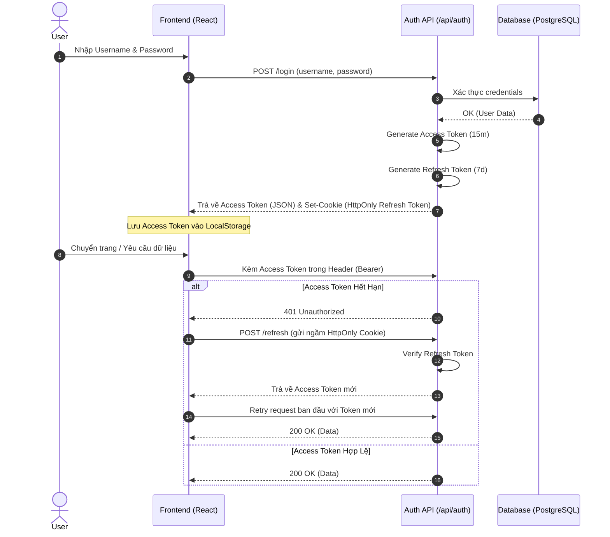
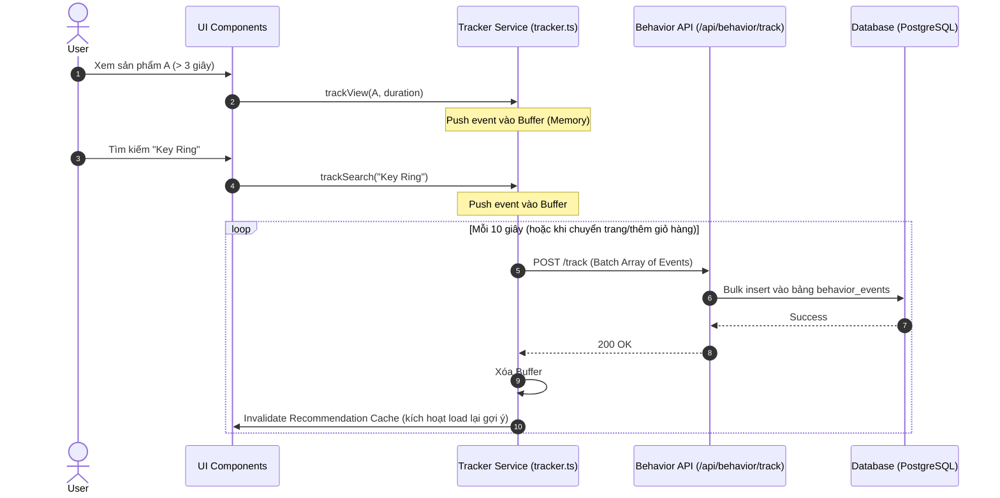
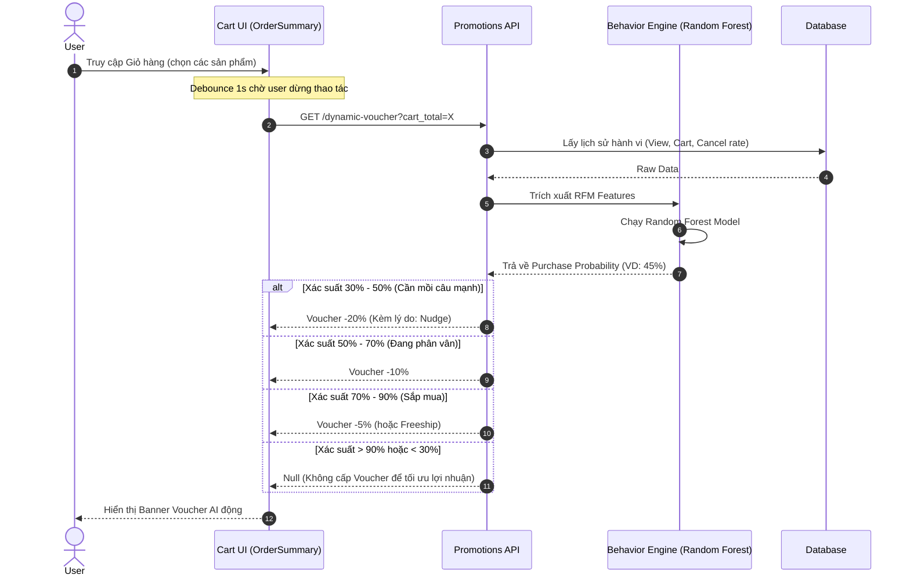
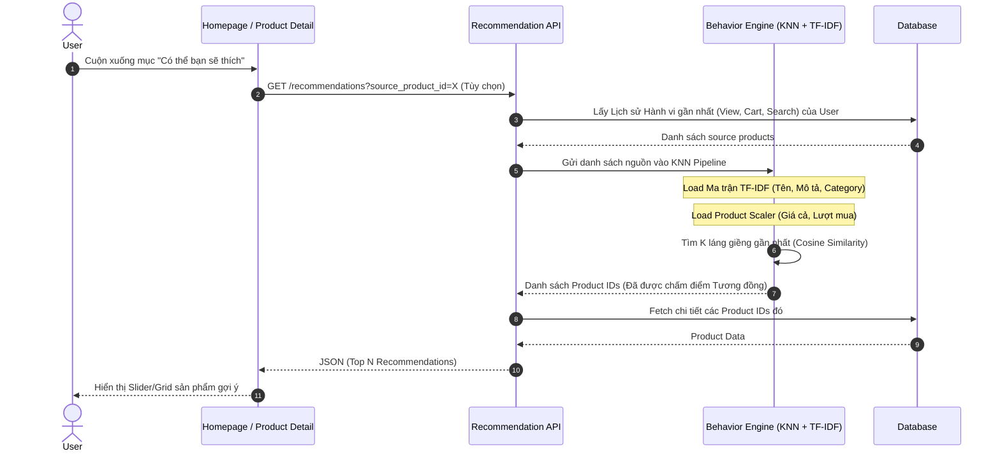
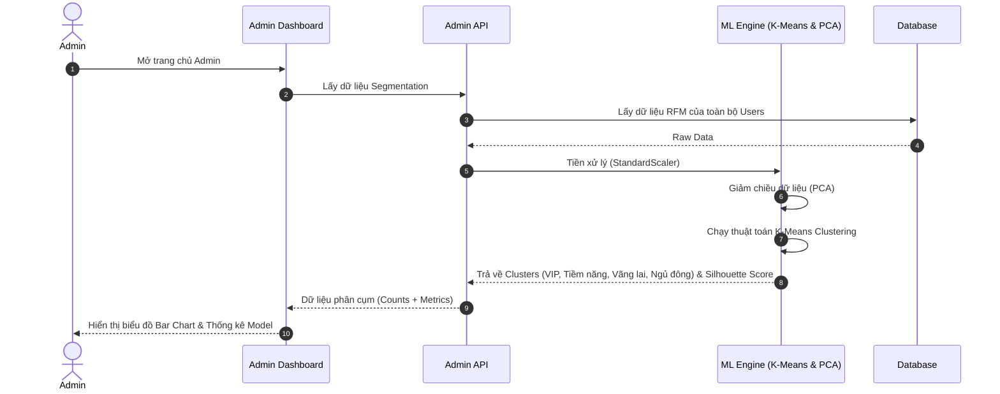

# Epi-SynLethal: Sequence Diagrams

Tài liệu này mô tả các luồng hoạt động chính của hệ thống thông qua các sơ đồ tuần tự (Sequence Diagrams) sử dụng Mermaid.

---

## 1. Luồng Xác thực (Split-Token Authentication Flow)

Mô tả cách hệ thống đăng nhập, lưu trữ bảo mật bằng HttpOnly Cookie và tự động cấp mới (auto-refresh) Access Token khi hết hạn mà không làm gián đoạn trải nghiệm người dùng.

---

## 2. Luồng Theo dõi Hành vi (Behavior Tracking Flow)

Mô tả cách Frontend thu thập hành vi người dùng (nhìn ngắm sản phẩm, thêm vào giỏ, tìm kiếm) và gửi về Backend theo từng lô (batch) để tối ưu hiệu suất mạng.

---

## 3. Luồng Voucher AI Động (Dynamic AI Voucher Flow)

Mô tả luồng người dùng vào Giỏ hàng (Cart) và hệ thống Machine Learning ngầm tính toán xác suất mua hàng để tung ra Voucher cá nhân hóa.

---

## 4. Luồng Gợi ý Sản phẩm (Product Recommendation Flow)

Mô tả cách thuật toán KNN kết hợp với xử lý ngôn ngữ tự nhiên (TF-IDF) tìm ra các sản phẩm liên quan để cross-sell.

---

## 5. Luồng Cập nhật & Phân cụm ngầm (Customer Segmentation Cron/Background)

Luồng phân cụm dữ liệu Admin Dashboard (K-Means). Thực tế luồng này có thể chạy ngầm (cron job) hoặc khi Admin truy cập Dashboard.

