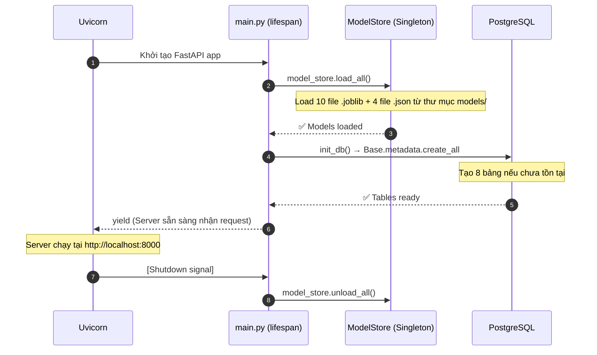
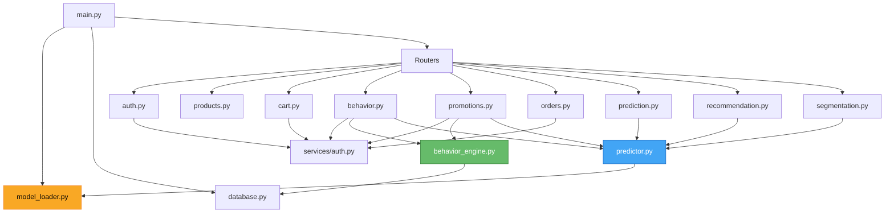

# Backend Deep Dive — Quy trình khởi động & Chi tiết Logic

> Tài liệu mô tả chi tiết cách Backend FastAPI hoạt động: từ lúc khởi động, load models, đến từng API endpoint và logic xử lý bên trong.

---

## 1. Quy trình Khởi động Server

Khi chạy `uvicorn main:app --reload`, hệ thống thực hiện **2 bước tuần tự** trong hàm `lifespan()`:



### 1.1. ModelStore — Load ML Artifacts

File: `app/services/model_loader.py`

`ModelStore` là một **Singleton** — chỉ tồn tại 1 instance duy nhất trong toàn bộ vòng đời server. Khi `load_all()` được gọi, nó đọc 14 file từ thư mục `backend/models/`:

| File | Key trong `models{}` | Mục đích |
|------|---------------------|----------|
| `random_forest_model.joblib` | `rf` | Dự đoán xác suất mua hàng |
| `scaler_rfm.joblib` | `scaler_rfm` | Chuẩn hóa RFM features cho RF |
| `kmeans_model.joblib` | `kmeans` | Phân cụm khách hàng |
| `pca_transformer.joblib` | `pca` | Giảm chiều dữ liệu cho K-Means |
| `scaler_segmentation.joblib` | `scaler_seg` | Chuẩn hóa features cho PCA |
| `knn_model.joblib` | `knn` | Tìm sản phẩm tương tự |
| `tfidf_vectorizer.joblib` | `tfidf` | Vector hóa text (tên, mô tả SP) |
| `scaler_product.joblib` | `scaler_product` | Chuẩn hóa features sản phẩm |
| `product_features_matrix.joblib` | `product_matrix` | Ma trận đặc trưng 4499 sản phẩm |
| `label_encoder_country.joblib` | `le_country` | Mã hóa quốc gia → số |
| `rf_model_metadata.json` | `configs["rf"]` | Metrics, feature_columns, version |
| `segmentation_config.json` | `configs["seg"]` | Tên cluster, silhouette score |
| `knn_config.json` | `configs["knn"]` | Hit rate, total_products |
| `product_mappings.json` | `configs["product_mappings"]` | stock_code ↔ index mapping |

### 1.2. Database — 8 Bảng ORM

File: `app/db_models.py`

| Bảng | Quan hệ | Vai trò |
|------|---------|---------|
| `users` | → cart_items, behavior_events | Tài khoản (email, password_hash, is_admin) |
| `products` | — | Sản phẩm (stock_code, parent_sku, price, category) |
| `cart_items` | → users, products | Giỏ hàng (user_id, product_id, quantity) |
| `behavior_events` | → users, products | Hành vi tracking (event_type, duration, metadata JSONB) |
| `orders` | → users, order_items | Đơn hàng (total_amount, status, shipping_address) |
| `order_items` | → orders, products | Chi tiết đơn (quantity, price_at_time) |
| `promotions` | → promotion_usages | Mã khuyến mãi (code, discount_type, target_audience) |
| `promotion_usages` | → users, promotions, orders | Lịch sử sử dụng mã (1 user - 1 promo - 1 order) |
| `refresh_tokens` | → users | Refresh token cho Split-Token Auth |

---

## 2. Cấu trúc Thư mục

```
backend/
├── main.py                    # Entry point: lifespan, CORS, router registration
├── app/
│   ├── database.py            # AsyncEngine, session factory, init_db()
│   ├── db_models.py           # 9 SQLAlchemy ORM models
│   ├── schemas/
│   │   └── models.py          # Pydantic request/response schemas (CustomerFeatures, etc.)
│   ├── services/
│   │   ├── model_loader.py    # ModelStore singleton — load/unload .joblib
│   │   ├── auth.py            # JWT encode/decode, bcrypt hash/verify, get_current_user
│   │   ├── predictor.py       # ML logic: predict_purchase, recommend_products, segmentation
│   │   └── behavior_engine.py # compute_rfm_from_behavior, get_recommendation_sources
│   └── routers/
│       ├── auth.py            # /auth/login, /register, /refresh, /logout, /me
│       ├── products.py        # /products (grouped), /products/{id} (with variants), admin CRUD
│       ├── cart.py             # /cart CRUD, /cart/checkout
│       ├── behavior.py        # /behavior/track, /recommendations, /profile
│       ├── promotions.py      # Admin CRUD, /available, /apply, /dynamic-voucher, /insights
│       ├── orders.py          # /orders/me, /admin/orders (paginated)
│       ├── prediction.py      # /predict/purchase, /models/info
│       ├── recommendation.py  # /recommend/{stock_code}
│       └── segmentation.py    # /segment/customer, /segments/overview
├── models/                    # 14 ML artifact files (.joblib + .json)
├── scripts/                   # Utility & maintenance scripts (xem Section 6)
└── data/                      # CSV data files
```

---

## 3. Service Layer — Logic Chi tiết

### 3.1. `auth.py` (Service)

| Hàm | Input → Output | Mô tả |
|-----|---------------|-------|
| `hash_password(plain)` | str → str | bcrypt hash |
| `verify_password(plain, hashed)` | str, str → bool | bcrypt check |
| `create_access_token(user_id)` | int → JWT string | Tạo JWT (exp: 120 phút) |
| `get_current_user(credentials, db)` | Bearer Token → User | **FastAPI Dependency** — decode JWT, query DB, trả User |

### 3.2. `predictor.py` — ML Core

#### `predict_purchase(features: CustomerFeatures) → dict`
Pipeline đầy đủ nhất của hệ thống:

```
Input (12 RFM features)
    ↓
1. Label encode "country" → country_encoded (int)
    ↓
2. Lấy RFM subset → Scale (scaler_seg) → PCA → K-Means predict → segment_id
    ↓
3. Ghép feature_map = {12 features + segment_id + country_encoded}
    ↓
4. Sắp xếp theo đúng thứ tự rf_feature_cols (từ metadata.json)
    ↓
5. RF.predict_proba() → probability
    ↓
Output: {will_purchase, probability, segment_id, segment_name, show_promotion}
```

#### `recommend_products(stock_code, top_k) → dict`
```
1. Tra stock_code → index (từ product_mappings.json)
2. Lấy dòng tương ứng trong product_matrix (sparse matrix TF-IDF + numeric)
3. KNN.kneighbors() → distances[], indices[]
4. Chuyển index → stock_code, tính similarity = 1 - distance
Output: {source_product, recommendations[{rank, stock_code, similarity}]}
```

#### `get_segments_overview() → dict`
Đọc thẳng từ `segmentation_config.json` → trả về segment counts, names, silhouette score. Không chạy model.

#### `get_model_info() → dict`
Gộp metrics từ cả 3 config JSON (rf, seg, knn) → hiển thị trên Admin Dashboard.

### 3.3. `behavior_engine.py` — Chuyển đổi Events → Features

#### `compute_rfm_from_behavior(user_id, db) → dict`
Hàm quan trọng nhất — biến dữ liệu thô trong bảng `behavior_events` thành 12 features cho Random Forest:

| Feature | Cách tính |
|---------|-----------|
| `recency` | `now - last_event` (ngày) |
| `frequency` | Đếm "sessions" — nhóm events cách nhau < 30 phút |
| `monetary` | Tổng `product.price × quantity` trong giỏ hàng hiện tại |
| `avg_order_value` | `monetary / sessions` |
| `avg_items_per_order` | `total_cart_items / sessions` |
| `total_unique_products` | Đếm distinct product_id trong events |
| `avg_days_between_orders` | `days_since_first / (sessions - 1)` |
| `cancellation_rate` | **Real SQL query:** `COUNT(CANCELED) / COUNT(total_orders)` |
| `days_since_first_purchase` | `now - first_event` (ngày) |
| `is_weekend_shopper` | `weekend_events / total_events` |
| `favorite_hour` | Hour có nhiều events nhất |
| `country` | Hardcode "United Kingdom" (dataset gốc chủ yếu UK) |

#### `get_recommendation_sources(user_id, db, current_product_id) → list`
Thu thập nguồn gợi ý từ 5 kênh, sắp xếp theo mức ưu tiên:

| # | Nguồn | Weight | Giải thích |
|---|-------|--------|-----------|
| 1 | Sản phẩm đang xem | 1.0 | Ưu tiên cao nhất |
| 2 | Xem gần đây (30 phút, >5s) | 1.0 | Recency matters |
| 3 | Xem nhiều nhất all-time (by duration) | 0.1–0.4 | Giảm weight để tránh stagnation |
| 4 | Top 5 sản phẩm trong giỏ | 0.7 | Intent mạnh |
| 5 | Sản phẩm đã mua (COMPLETED orders) | 0.9 | Cross-sell |
| 6 | Search history → match product name | 0.4 | ILIKE pattern matching |

---

## 4. Router Layer — API Endpoints

### 4.1. Auth (`/api/auth/*`)

| Method | Endpoint | Auth | Mô tả |
|--------|----------|------|-------|
| POST | `/auth/register` | ❌ | Tạo user, trả access_token + set HttpOnly cookie refresh_token |
| POST | `/auth/login` | ❌ | Xác thực, trả access_token + set cookie |
| POST | `/auth/logout` | ❌ | Xóa refresh_token khỏi DB + clear cookie |
| POST | `/auth/refresh` | Cookie | Đọc cookie → tìm trong DB → cấp access_token mới |
| GET | `/auth/me` | Bearer | Trả user profile |

### 4.2. Products (`/api/products/*`)

| Method | Endpoint | Auth | Mô tả |
|--------|----------|------|-------|
| GET | `/products` | ❌ | Danh sách SP **grouped by parent_sku** (subquery MIN(id)) |
| GET | `/products/categories` | ❌ | Danh sách category + count |
| GET | `/products/{id}` | ❌ | Chi tiết SP + danh sách `variants` cùng parent_sku |
| GET | `/admin/products` | Admin | Danh sách tất cả SP (kể cả out-of-stock) |
| POST | `/admin/products` | Admin | Tạo SP mới |
| PUT | `/admin/products/{id}` | Admin | Cập nhật SP |
| DELETE | `/admin/products/{id}` | Admin | Xóa SP |

### 4.3. Cart & Checkout (`/api/cart/*`)

| Method | Endpoint | Auth | Mô tả |
|--------|----------|------|-------|
| GET | `/cart` | Bearer | Lấy giỏ hàng (selectinload product) |
| POST | `/cart` | Bearer | Thêm SP (nếu đã có → tăng quantity) |
| PATCH | `/cart/{item_id}` | Bearer | Đổi quantity (≤0 → xóa) |
| DELETE | `/cart/{item_id}` | Bearer | Xóa khỏi giỏ |
| POST | `/cart/checkout` | Bearer | **Luồng checkout đầy đủ** (xem bên dưới) |

**Luồng Checkout chi tiết:**
```
1. Validate selected_item_ids → fetch CartItems + eager load Product
2. Tính subtotal = Σ(price × quantity)
3. Nếu có promotion_id → validate promo → tính discount
4. Tạo Order (status=COMPLETED)
5. Tạo OrderItems + tăng product.purchase_count + tăng product.num_customers
6. Tạo PromotionUsage (nếu có promo)
7. Xóa CartItems đã checkout
8. Commit transaction
```

### 4.4. Behavior Tracking & ML Recommendations (`/api/behavior/*`)

| Method | Endpoint | Auth | Mô tả |
|--------|----------|------|-------|
| POST | `/behavior/track` | Bearer | Batch-save events (view, add_to_cart, search...) |
| GET | `/behavior/recommendations` | Bearer | **Multi-source KNN** (xem bên dưới) |
| GET | `/behavior/profile` | Bearer | Tính RFM → RF predict → trả prediction |

**Luồng Recommendations chi tiết:**
```
1. get_recommendation_sources() → thu thập tối đa ~35 source products
2. Với mỗi source → KNN.kneighbors(top_k=30) → candidates
3. Loại bỏ source products khỏi kết quả
4. Score = similarity × source_weight
5. Round-Robin Interleave (đa dạng hóa): lấy 1 từ mỗi queue xen kẽ
6. Enrich: query DB để lấy name, image, price (chỉ giữ SP tồn tại trong DB)
7. Trả về top 20 recommendations
Fallback: nếu không có behavior → trả top 10 popular products
```

### 4.5. Promotions (`/api/promotions/*`)

| Method | Endpoint | Auth | Mô tả |
|--------|----------|------|-------|
| GET | `/promotions` | Admin | Danh sách tất cả promotions |
| POST | `/promotions` | Admin | Tạo promotion mới |
| DELETE | `/promotions/{id}` | Admin | Xóa promotion |
| GET | `/promotions/available` | Bearer | Lọc promotions phù hợp (target_audience, min_amount, expiry) |
| POST | `/promotions/apply` | Bearer | Validate mã giảm giá → tính discount_amount |
| GET | `/promotions/dynamic-voucher` | Bearer | **AI Voucher** — RFM → RF → probability → voucher |
| GET | `/promotions/insights/suggestions` | Admin | SP có views cao nhưng mua thấp → đề xuất tạo voucher |

**Dynamic Voucher Logic:**
```
prob < 0.3  → null (không tặng — user chỉ lướt)
0.3 – 0.5  → PERCENTAGE 20% (cần mồi câu mạnh)
0.5 – 0.7  → PERCENTAGE 10% (đang phân vân)
0.7 – 0.9  → FIXED ~5% cart_total (sắp mua, đẩy nhẹ)
prob > 0.9  → null (chắc chắn mua — tối ưu lợi nhuận)
```

### 4.6. Orders (`/api/orders/*`)

| Method | Endpoint | Auth | Mô tả |
|--------|----------|------|-------|
| GET | `/orders/me` | Bearer | Đơn hàng của user (selectinload items → product) |
| GET | `/admin/orders` | Admin | Tất cả đơn hàng, phân trang |
| PUT | `/admin/orders/{id}/status` | Admin | Cập nhật trạng thái đơn |

### 4.7. ML Direct APIs

| Method | Endpoint | Auth | Mô tả |
|--------|----------|------|-------|
| POST | `/predict/purchase` | ❌ | Truyền thẳng 12 features → RF predict |
| GET | `/models/info` | ❌ | Metrics của cả 3 models (RF, K-Means, KNN) |
| GET | `/recommend/{stock_code}` | ❌ | KNN gợi ý theo stock_code |
| POST | `/segment/customer` | ❌ | Phân cụm 1 customer từ RFM features |
| GET | `/segments/overview` | ❌ | Thống kê phân cụm toàn bộ (từ config JSON) |
| GET | `/health` | ❌ | Trạng thái server + danh sách models đã load |

---

## 5. Sơ đồ Phụ thuộc Giữa Các Module



**Chú thích:**
- 🟡 `model_loader.py` — Singleton chứa toàn bộ ML models
- 🔵 `predictor.py` — Orchestrator gọi models để predict/recommend/segment
- 🟢 `behavior_engine.py` — Chuyển đổi raw DB events → ML features

---

## 6. Utility Scripts (`scripts/`)

Tất cả các script tiện ích đã được gom chung vào thư mục `scripts/`. Chạy từ thư mục `backend/`:

```bash
python scripts/<tên_file>.py
```

### 📦 Scripts Khởi tạo & Seed Data

| Script | Mục đích | Khi nào dùng |
|--------|----------|-------------|
| `full_import.py` | Import toàn bộ sản phẩm từ CSV gốc vào bảng `products` | Setup lần đầu |
| `seed.py` | Seed dữ liệu mẫu (users, products, orders) | Setup lần đầu |
| `seed_promos.py` | Tạo promotions mẫu (WELCOME10, LOYAL20...) | Setup lần đầu |
| `seed_test_data.py` | Tạo dữ liệu test (behavior events, orders) | Testing |
| `init_admin.py` | Tạo tài khoản admin (`demo@shop.com`) | Setup lần đầu |
| `verify_import.py` | Kiểm tra số lượng products đã import đúng chưa | Sau `full_import` |

### 🔧 Scripts Migration (Thay đổi Schema)

| Script | Mục đích | Khi nào dùng |
|--------|----------|-------------|
| `migrate.py` | Thêm cột `phone`, `address` cho `users`; `shipping_address`, `phone` cho `orders` | Đã chạy |
| `migrate_parent_sku.py` | Thêm cột `parent_sku` + index; tách chữ cái cuối StockCode bằng regex | Đã chạy |
| `migrate_promo.py` | Thêm cột mới cho bảng `promotions` | Đã chạy |
| `patch_categories.py` | Phân loại lại `category` cho products (từ "Other" → category cụ thể) | Đã chạy |

### 🧹 Scripts Dọn dẹp

| Script | Mục đích | Khi nào dùng |
|--------|----------|-------------|
| `clear_db.py` | Xóa toàn bộ dữ liệu (giữ lại admin), reset sequences | Khi cần test sạch |
| `clear_behavior.py` | Chỉ xóa bảng `behavior_events` | Khi cần reset tracking |
| `fix.py` | Sửa sequence `users_id_seq` khi bị lệch sau import | Khi gặp lỗi duplicate key |

### 🗑️ Đã xóa (Debug cũ, không còn giá trị)

- `debug_74.py` — Debug behavior events cho product ID 74
- `debug_clocks.py` — So sánh timezone Python vs PostgreSQL
- `debug_recs.py` / `deep_debug_recs.py` — Debug thuật toán recommendation
- `sample_other.py` — List products category "Other"
