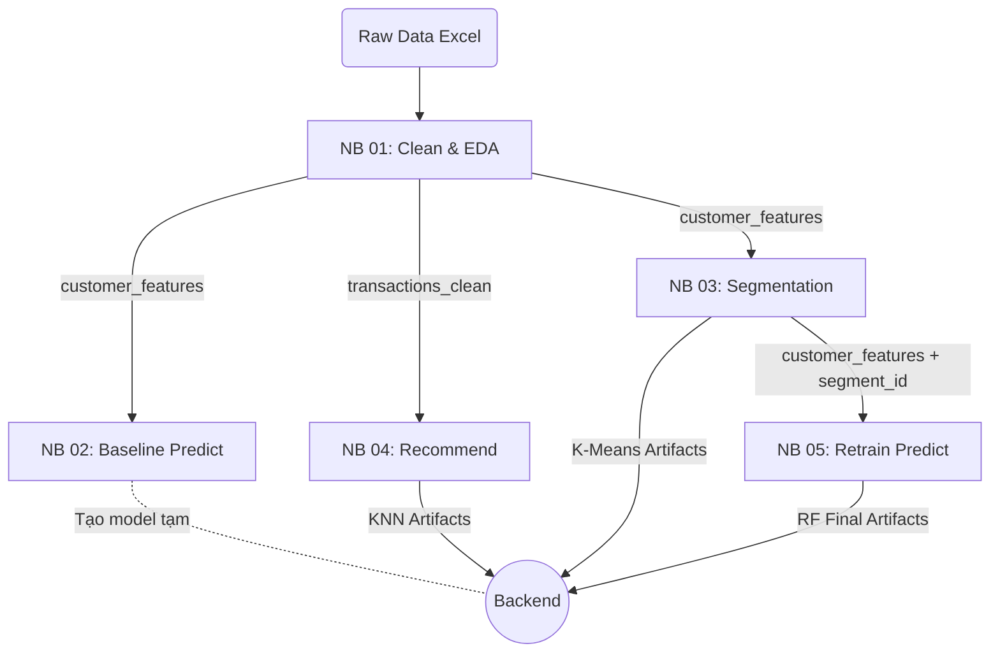

# Machine Learning Pipeline Deep Dive

Tài liệu này phân tích chi tiết quy trình huấn luyện Machine Learning của dự án, được chia thành 5 Jupyter Notebooks tuần tự. Mỗi Notebook đảm nhận một chức năng cốt lõi trong chuỗi xử lý dữ liệu từ dạng thô (raw data) đến dạng mô hình có thể triển khai (deployable artifacts).

---

## 1. Notebook `01_eda_preprocessing.ipynb`

### Mục đích & Chức năng
*   **Nhiệm vụ:** Tải bộ dữ liệu thô (Online Retail II), làm sạch dữ liệu (loại bỏ null, đơn hủy, giá trị âm), phân tích khám phá (EDA), và quan trọng nhất là **Feature Engineering** (trích xuất đặc trưng RFM và hành vi khách hàng).
*   **Lý do tồn tại:** Dữ liệu thực tế luôn chứa nhiễu và không thể trực tiếp đưa vào thuật toán ML. Thuật toán học máy không hiểu "lịch sử giao dịch", nó chỉ hiểu các con số tĩnh. Notebook này đóng vai trò như một "nhà máy chế biến" biến dữ liệu thô thành các vector đặc trưng.
*   **Nếu bỏ đi thì sao?:** Toàn bộ hệ thống sụp đổ. Không có data sạch và features, các notebook ML sau (02, 03, 04) không có dữ liệu đầu vào để huấn luyện.

### File xuất ra (Outputs) & Vai trò
| Tên file | Mục đích | Ai dùng file này? |
|----------|----------|------------------|
| `transactions_clean.csv` | Dữ liệu giao dịch đã làm sạch (chứa Invoice, StockCode, Quantity, Price...). | **NB04** (Recommend) để tạo TF-IDF matrix. |
| `customer_features.csv` | Ma trận đặc trưng khách hàng (12 cột: recency, frequency, monetary, label...). | **NB02** (Predict), **NB03** (Segment), **NB05** (Retrain). |

---

## 2. Notebook `02_purchase_prediction.ipynb`

### Mục đích & Chức năng
*   **Nhiệm vụ:** Huấn luyện mô hình Random Forest phân loại khách hàng xem họ có khả năng quay lại mua hàng trong 30 ngày tới hay không (Target = 1/0).
*   **Lý do tồn tại:** Tạo ra "bộ não" dự đoán tỷ lệ mua hàng (Purchase Probability), từ đó cung cấp căn cứ để hệ thống cấp phát các mã giảm giá linh hoạt (Dynamic Voucher) để "kích cầu" đúng tệp khách.
*   **Nếu bỏ đi thì sao?:** Hệ thống vẫn chạy được các tính năng phân cụm và gợi ý sản phẩm, nhưng tính năng AI Voucher thông minh sẽ không hoạt động (không biết ai sắp mua để cho mã 5%, ai không định mua để cho mã 20%).

### File xuất ra (Outputs) & Vai trò
| Tên file | Mục đích | Ai dùng file này? |
|----------|----------|------------------|
| `random_forest_model.joblib` | Mô hình RF đã huấn luyện với trọng số tối ưu. | Backend FastAPI (`predictor.py`) dùng để dự đoán real-time. |
| `scaler_rfm.joblib` | Bộ chuẩn hóa (Scaler) để đưa dữ liệu mới về cùng scale với dữ liệu train. | Backend FastAPI. |
| `rf_model_metadata.json` | Metadata (metrics, F1, features, threshold) để hiển thị Dashboard admin. | Backend FastAPI (`/models/info`). |

*(Lưu ý: Notebook 02 tạo ra model tạm thời. Model này sau đó được thay thế bởi phiên bản mạnh hơn ở Notebook 05).*

---

## 3. Notebook `03_customer_segmentation.ipynb`

### Mục đích & Chức năng
*   **Nhiệm vụ:** Dùng PCA giảm chiều dữ liệu và thuật toán K-Means để gom nhóm khách hàng thành các cụm (clusters) dựa trên hành vi (VIP, Tiềm năng, Vãng lai, Ngủ đông).
*   **Lý do tồn tại:** Giúp Admin hiểu được các tệp khách hàng. Hơn nữa, kết quả phân cụm (Segment ID) sẽ được dùng làm **một Feature mới** để cải thiện độ chính xác cho mô hình Random Forest.
*   **Nếu bỏ đi thì sao?:** Không có Dashboard phân loại khách. Mô hình Random Forest ở bước sau sẽ mất đi một Feature quan trọng, dẫn tới dự đoán kém chính xác hơn.

### File xuất ra (Outputs) & Vai trò
| Tên file | Mục đích | Ai dùng file này? |
|----------|----------|------------------|
| `customer_features_with_segments.csv` | Tương tự file từ NB01 nhưng có thêm cột `segment_id`. | **NB05** (Retrain) dùng làm input train model mới. |
| `kmeans_model.joblib` | Mô hình K-Means để gán nhãn cho người dùng mới. | Backend FastAPI (`predictor.py`). |
| `pca_transformer.joblib` & `scaler_segmentation.joblib` | Bộ giảm chiều và chuẩn hóa trước khi đưa qua K-Means. | Backend FastAPI (`predictor.py`). |
| `segmentation_config.json` | Metadata phân cụm (Silhouette, Davies-Bouldin, tên cụm). | Backend FastAPI (`/models/info`). |

---

## 4. Notebook `04_product_recommendation.ipynb`

### Mục đích & Chức năng
*   **Nhiệm vụ:** Dùng NLP (TF-IDF) trích xuất từ khóa từ tên/mô tả sản phẩm, kết hợp giá bán/lượt mua, sau đó dùng thuật toán K-Nearest Neighbors (KNN - Cosine Distance) để tìm ra các sản phẩm giống nhau.
*   **Lý do tồn tại:** Là trái tim của tính năng "Sản phẩm tương tự" và "Gợi ý dựa trên giỏ hàng" (Content-based filtering). Tăng cross-sell cho hệ thống.
*   **Nếu bỏ đi thì sao?:** Hệ thống E-commerce mất tính năng Gợi ý cá nhân hóa. Chỉ có thể hiển thị sản phẩm "Phổ biến nhất" cho tất cả mọi người, làm giảm tỷ lệ chuyển đổi (Conversion Rate).

### File xuất ra (Outputs) & Vai trò
| Tên file | Mục đích | Ai dùng file này? |
|----------|----------|------------------|
| `knn_model.joblib` | Cấu trúc cây KNN dùng để truy vấn neighbors cực nhanh. | Backend FastAPI (`predictor.py`). |
| `tfidf_vectorizer.joblib` & `scaler_product.joblib` | Bộ vector hóa text và scaler cho sản phẩm. | Backend FastAPI (nếu cần biến đổi SP mới). |
| `product_features_matrix.joblib` | Ma trận đặc trưng gốc (sparse matrix) chứa tất cả sản phẩm. | Backend truyền vào KNN để tính khoảng cách. |
| `product_mappings.json` & `knn_config.json` | Mapping từ stock_code sang row index và ngược lại; metadata. | Backend FastAPI (`predictor.py`). |

---

## 5. Notebook `05_retrain_and_evaluate.ipynb`

### Mục đích & Chức năng
*   **Nhiệm vụ:** Load lại bộ dataset đã được gắn nhãn phân cụm `segment_id` (từ NB03). Huấn luyện lại (Retrain) mô hình Random Forest với 13 features (12 features cũ + 1 feature `segment_id` mới).
*   **Lý do tồn tại:** Việc thêm thông tin "khách hàng này thuộc nhóm VIP hay Ngủ đông" giúp cây quyết định (Decision Tree) chia nhánh chuẩn xác hơn rất nhiều, đẩy chỉ số F1-Score lên cao hơn so với mô hình ở NB02.
*   **Nếu bỏ đi thì sao?:** Hệ thống vẫn chạy được với model cũ ở NB02, nhưng bị lãng phí thông tin quý giá từ mô hình K-Means, độ chính xác (Accuracy / ROC-AUC) của AI Voucher không đạt mức tối ưu nhất.

### File xuất ra (Outputs) & Vai trò
| Tên file | Mục đích | Ai dùng file này? |
|----------|----------|------------------|
| `random_forest_model.joblib` | Mô hình RF phiên bản NÂNG CẤP (Ghi đè file cũ của NB02). | Backend FastAPI (`predictor.py`) để dự đoán. |
| `rf_model_metadata.json` | Cập nhật lại metrics mới (Ghi đè file cũ của NB02). | Backend FastAPI (`/models/info`). |
| `label_encoder_country.joblib` | Bộ mã hóa quốc gia dùng cho features. | Backend FastAPI (`predictor.py`). |

---

## Tóm lược Luồng Dữ liệu (Data Flow)

Mọi file `.joblib` và `.json` xuất ra ở bước cuối cùng đều được hệ thống backend (cụ thể là class `ModelStore` trong `model_loader.py`) load toàn bộ lên RAM khi khởi động để phục vụ Inference Real-time.
