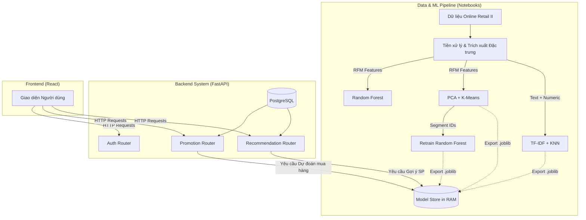
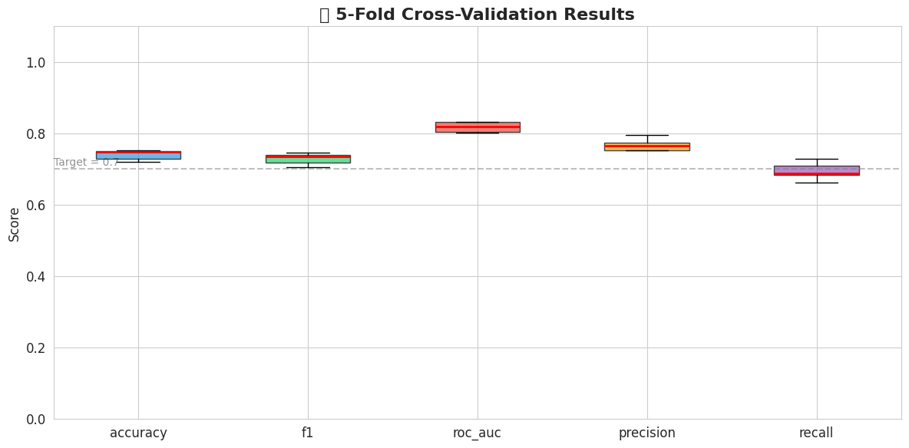

# Báo Cáo Đồ Án: Hệ Thống E-Commerce Tích Hợp Machine Learning

> Báo cáo chuyên ngành tổng kết quá trình xây dựng, huấn luyện mô hình và tích hợp hệ thống Recommendation & Customer Segmentation.

---

## 1. Giới thiệu

Trong bối cảnh thương mại điện tử hiện đại, việc cá nhân hóa trải nghiệm người dùng không chỉ là lợi thế cạnh tranh mà còn là tiêu chuẩn bắt buộc. Đồ án này hướng tới mục tiêu xây dựng một **Hệ thống E-commerce tích hợp Machine Learning** hoàn chỉnh, hoạt động theo mô hình Client-Server.

**Mục đích chính của đồ án:**

- Thu thập, làm sạch và xử lý dữ liệu giao dịch thương mại điện tử thực tế.
- Xây dựng các mô hình Machine Learning giải quyết 3 bài toán lõi: **Dự đoán khả năng mua hàng (Purchase Prediction)**, **Phân cụm khách hàng (Customer Segmentation)**, và **Gợi ý sản phẩm (Product Recommendation)**.
- Đưa các mô hình học máy vào thực tiễn bằng cách tích hợp trực tiếp vào một hệ thống Backend (FastAPI) để phục vụ cho Frontend (React/Vite). Cụ thể là ứng dụng dự đoán mua hàng vào việc cấp phát các mã giảm giá động (Dynamic Voucher) một cách thông minh nhằm tối ưu tỷ lệ chuyển đổi.

---

## 2. Kiến trúc tổng thể của Hệ thống

Hệ thống được thiết kế theo quy trình **End-to-End Pipeline**, chia làm hai giai đoạn lớn: Giai đoạn Huấn luyện (Offline Training) và Giai đoạn Triển khai (Online Inference).

### 2.1. Quy trình thực hiện

1. **Data Pipeline:** Đọc dữ liệu từ file thô → Làm sạch → Trích xuất đặc trưng (RFM).
2. **Modeling Pipeline:** Huấn luyện 3 nhóm mô hình thuật toán. Sau đó xuất toàn bộ kết quả ra các file `*.joblib` và metadata.
3. **Inference Pipeline (Backend):** Hệ thống API dùng Singleton `ModelStore` tải mô hình lên RAM khi khởi động. Khi có Request từ Client, Backend thực hiện tính toán real-time đặc trưng và dự đoán để phản hồi kết quả trực tiếp cho người dùng.

### 2.2. Sơ đồ kiến trúc tổng quan

---

## 3. Dữ liệu và tiền xử lý

### 3.1. Các tập dữ liệu

Trong đề tài này sử dụng tập dữ liệu **Online Retail II** lấy từ nền tảng Kaggle (nguồn gốc từ UCI Machine Learning Repository).

- **Nguồn gốc:** Tập dữ liệu thu thập các giao dịch trực tuyến của một cửa hàng quà tặng tại Vương quốc Anh từ tháng 12/2009 đến tháng 12/2011.
- **Đặc điểm & Số lượng mẫu:** File dữ liệu thô ban đầu có **1,067,371 dòng** với 8 cột, chiếm **249.1 MB** bộ nhớ. Dữ liệu có dạng Transactional, bao gồm các cột: `Invoice`, `StockCode`, `Description`, `Quantity`, `InvoiceDate`, `Price`, `Customer ID`, và `Country`.

**Bảng 1: Cấu trúc Dataset ban đầu**

| Cột         | Kiểu dữ liệu | Non-Null Count |
| ----------- | ------------ | -------------- |
| Invoice     | object       | 1,067,371      |
| StockCode   | object       | 1,067,371      |
| Description | object       | 1,062,989      |
| Quantity    | int64        | 1,067,371      |
| InvoiceDate | datetime64   | 1,067,371      |
| Price       | float64      | 1,067,371      |
| Customer ID | float64      | 824,364        |
| Country     | object       | 1,067,371      |

### 3.2. Phân tích giá trị thiếu (Missing Values)

Phân tích giá trị thiếu cho thấy hai cột bị ảnh hưởng, trong đó `Customer ID` là nghiêm trọng nhất:

| Cột             | Số lượng thiếu | Tỷ lệ (%) |
| --------------- | -------------- | --------- |
| Customer ID     | 243,007        | 22.77%    |
| Description     | 4,382          | 0.41%     |
| Các cột còn lại | 0              | 0.00%     |

> **Nhận xét:** Gần 23% dữ liệu không có thông tin khách hàng, điều này ảnh hưởng trực tiếp đến khả năng xây dựng hồ sơ hành vi, nên bước làm sạch bắt buộc phải loại bỏ các dòng này.

### 3.3. Tiền xử lý dữ liệu (Data Preprocessing)

Quá trình tiền xử lý là bắt buộc để lọc bỏ nhiễu và chuẩn bị cho mô hình. Các bước chính và kết quả cụ thể:

**Bảng 2: Pipeline Làm sạch dữ liệu**

| Bước                                      | Dòng còn lại | Ghi chú               |
| ----------------------------------------- | ------------ | --------------------- |
| Dữ liệu ban đầu                           | 1,067,371    | —                     |
| Sau loại bỏ null Customer ID              | 824,364      | -22.77%               |
| Sau loại bỏ đơn hủy (Invoice bắt đầu 'C') | 805,620      |                       |
| Sau loại bỏ Quantity/Price ≤ 0            | 805,549      |                       |
| Sau loại bỏ StockCode không hợp lệ        | **802,679**  | POST, BANK CHARGES... |

> ✅ **Kết quả:** Dữ liệu sạch còn lại **802,679 dòng** (75.2% dữ liệu gốc), bao gồm **5,861 khách hàng** và **4,624 sản phẩm**, trong khoảng thời gian từ 2009-12-01 đến 2011-12-09.

### 3.4. Phân tích khám phá dữ liệu (EDA)

#### a) Top 10 sản phẩm bán chạy nhất

| Hạng | StockCode | Mô tả                              | Tổng SL | Doanh thu (£) | Số đơn |
| ---- | --------- | ---------------------------------- | ------- | ------------- | ------ |
| 1    | 84077     | WORLD WAR 2 GLIDERS ASSTD DESIGNS  | 109,169 | 24,905.87     | 920    |
| 2    | 85123A    | WHITE HANGING HEART T-LIGHT HOLDER | 93,640  | 252,072.46    | 4,888  |
| 3    | 23843     | PAPER CRAFT, LITTLE BIRDIE         | 80,995  | 168,469.60    | 1      |
| 4    | 84879     | ASSORTED COLOUR BIRD ORNAMENT      | 79,913  | 127,074.17    | 2,652  |
| 5    | 23166     | MEDIUM CERAMIC TOP STORAGE JAR     | 77,916  | 81,416.73     | 195    |
| 6    | 85099B    | JUMBO BAG RED RETROSPOT            | 75,759  | 136,980.08    | 2,612  |
| 7    | 17003     | BROCADE RING PURSE                 | 71,129  | 14,827.71     | 387    |
| 8    | 21977     | PACK OF 60 PINK PAISLEY CAKE CASES | 55,270  | 26,733.45     | 1,578  |
| 9    | 84991     | 60 TEATIME FAIRY CAKE CASES        | 53,495  | 26,121.57     | 1,765  |
| 10   | 21212     | PACK OF 72 RETROSPOT CAKE CASES    | 46,107  | 22,214.26     | 1,348  |

#### b) Thống kê giá trị đơn hàng

| Chỉ số                  | Giá trị     |
| ----------------------- | ----------- |
| Trung bình (Mean)       | £475.97     |
| Trung vị (Median)       | £304.50     |
| Giá trị thấp nhất (Min) | £0.38       |
| Giá trị cao nhất (Max)  | £168,469.60 |

#### c) Phân bố tần suất mua hàng của khách

| Phân loại           | Số lượng khách | Tỷ lệ |
| ------------------- | -------------- | ----- |
| Khách chỉ mua 1 lần | 1,625          | 27.7% |
| Khách mua > 1 lần   | 4,236          | 72.3% |
| Khách mua > 10 lần  | 866            | 14.8% |

> **Nhận xét:** Đa số khách hàng (72.3%) có xu hướng quay lại mua hàng, tuy nhiên có đến 27.7% chỉ mua duy nhất một lần. Điều này khẳng định sự cần thiết của bài toán Dự đoán mua hàng và hệ thống Dynamic Voucher.

### 3.5. Trích xuất đặc trưng (Feature Engineering)

Từ dữ liệu sạch, tiến hành trích xuất **12 đặc trưng** cho mỗi khách hàng dựa trên mô hình **RFM mở rộng** (Recency, Frequency, Monetary + Behavioral Features).

Biến mục tiêu `will_purchase` được xây dựng bằng cách chia dữ liệu theo mốc thời gian: Training period trước 30/06/2011 và Prediction period sau đó.

**Phân bố biến mục tiêu (Target Variable):**

| Nhãn | Ý nghĩa             | Số lượng | Tỷ lệ     |
| ---- | ------------------- | -------- | --------- |
| 1    | Sẽ mua lại          | 2,528    | 50.3%     |
| 0    | Không mua lại       | 2,495    | 49.7%     |
|      | **Tỷ lệ imbalance** |          | **1:1.0** |

> ✅ **Nhận xét:** Dữ liệu target gần như cân bằng hoàn hảo (50/50), thuận lợi cho việc huấn luyện mô hình phân loại mà không cần đến các kỹ thuật xử lý imbalance phức tạp.

**Bảng 3: Tương quan của các đặc trưng với biến mục tiêu `will_purchase`**

| Đặc trưng                 | Hệ số tương quan | Hướng     |
| ------------------------- | ---------------- | --------- |
| recency                   | -0.456           | ⬇️ Nghịch |
| total_unique_products     | +0.307           | ⬆️ Thuận  |
| frequency                 | +0.259           | ⬆️ Thuận  |
| monetary                  | +0.131           | ⬆️ Thuận  |
| days_since_first_purchase | +0.084           | ⬆️ Thuận  |
| avg_days_between_orders   | +0.066           | ⬆️ Thuận  |
| avg_order_value           | +0.057           | ⬆️ Thuận  |
| cancellation_rate         | +0.046           | ⬆️ Thuận  |
| avg_unit_price            | -0.043           | ⬇️ Nghịch |
| favorite_hour             | -0.030           | ⬇️ Nghịch |
| country_encoded           | -0.029           | ⬇️ Nghịch |
| is_weekend_shopper        | +0.007           | —         |
| avg_items_per_order       | +0.001           | —         |

> **Nhận xét quan trọng:**
>
> - Đặc trưng **recency** (thời gian kể từ lần mua cuối) có tương quan nghịch mạnh nhất (-0.456), nghĩa là khách mua gần đây nhất có khả năng mua lại cao nhất.
> - **total_unique_products** (+0.307) và **frequency** (+0.259) cũng là các features quan trọng, cho thấy khách hàng đa dạng sản phẩm và mua thường xuyên có xu hướng quay lại.

---

## 4. Kỹ thuật học máy áp dụng

Hệ thống sử dụng kết hợp nhiều kỹ thuật học máy để giải quyết từng khía cạnh của bài toán.

### 4.1. Kỹ thuật Random Forest (Dự đoán mua hàng)

- **Bài toán:** Dự đoán khách hàng có quay lại mua hàng trong 30 ngày tới hay không (Bài toán Classification 0/1).
- **Kỹ thuật:** Sử dụng Random Forest Classifier. Thuật toán này sử dụng nhiều cây quyết định (Decision Trees) và phương pháp bầu chọn đa số (Ensemble Learning) giúp mô hình chống overfitting cực kỳ tốt so với Logistic Regression.
- **Tinh chỉnh tham số:** Áp dụng `GridSearchCV` để tìm ra bộ siêu tham số tốt nhất (`n_estimators`, `max_depth`, `min_samples_split`). Sử dụng `class_weight='balanced'` để xử lý vấn đề mất cân bằng lớp (Imbalanced Data). Đặc biệt, mô hình được **Retrain** ở Notebook 05 bằng cách thêm cột `segment_id` sinh ra từ K-Means làm một feature, đẩy mạnh độ chính xác.

### 4.2. Kỹ thuật PCA & K-Means (Phân cụm khách hàng)

- **Bài toán:** Gom nhóm tập khách hàng để thấu hiểu thị hiếu.
- **Kỹ thuật:**
  - **PCA (Principal Component Analysis):** Giảm số lượng chiều dữ liệu (từ 7 features RFM cốt lõi) xuống còn 3 thành phần chính để loại bỏ nhiễu mà vẫn giữ được >80% phương sai.
  - **K-Means Clustering:** Áp dụng phân cụm trên dữ liệu đã giảm chiều.
- **Tinh chỉnh:** Sử dụng phương pháp _Elbow Method_ và _Silhouette Score_ để xác định số cụm tối ưu ($K=4$). Bốn cụm được đặt tên theo ý nghĩa kinh doanh: VIP, Tiềm năng, Vãng lai, Ngủ đông.

### 4.3. Kỹ thuật TF-IDF & KNN (Gợi ý sản phẩm)

- **Bài toán:** Gợi ý danh sách sản phẩm tương đồng (Content-based Filtering).
- **Kỹ thuật:**
  - **TF-IDF Vectorizer:** Biến đổi phần `Description` (Mô tả sản phẩm) thành ma trận vector toán học.
  - **K-Nearest Neighbors (KNN):** Tìm kiếm các sản phẩm gần nhất trong không gian vector thông qua khoảng cách _Cosine Similarity_.
- **Tinh chỉnh:** Kết hợp ma trận TF-IDF (trọng số cao) cùng với đặc trưng số học như Giá, Tần suất bán (trọng số 0.3) để thuật toán KNN bao quát được cả ngữ nghĩa văn bản lẫn thuộc tính số học của sản phẩm.

---

## 5. Kết quả thử nghiệm, so sánh, đánh giá

### 5.1. Mô hình Dự đoán mua hàng (Random Forest)

Tiến hành đánh giá mô hình phân loại với mục tiêu dự đoán khách hàng có mua lại hay không.

**a) So sánh các mô hình (Model Comparison)**

Hệ thống đã thử nghiệm 3 cấu hình khác nhau: Baseline (Logistic Regression), Random Forest (Mặc định) và Random Forest (Tuned qua GridSearchCV).

*Kết quả tốt nhất:* Mô hình **Random Forest (Tuned)** đạt độ đo ROC-AUC cao nhất (0.7931), F1-Score (0.7022). Siêu tham số tối ưu tìm được: `max_depth=10, min_samples_leaf=4, n_estimators=100, class_weight='balanced'`.

**b) Kiểm chứng chéo (Cross-Validation)**

Để đảm bảo mô hình không bị quá khớp (overfitting), chiến lược 5-Fold Cross Validation đã được thực hiện.

Kết quả cho thấy độ ổn định cao trên các tập dữ liệu khác nhau:
- **Accuracy:** 0.7404 ± 0.0131
- **F1-Score:** 0.7290 ± 0.0154
- **ROC-AUC:** 0.8179 ± 0.0136

**c) Phân tích chi tiết lỗi (Confusion Matrix & ROC/PR Curves)**

Ma trận nhầm lẫn minh hoạ số lượng dự đoán đúng trên tập Test:
- **True Positives (TP - 336):** Dự đoán khách sẽ mua, thực tế có mua.
- **True Negatives (TN - 384):** Dự đoán không mua, thực tế không mua.
Đường cong ROC và Precision-Recall thể hiện khả năng phân tách tốt giữa hai lớp, cho thấy hiệu suất thuật toán rất ổn định, diện tích dưới đường cong lớn.

**d) Độ quan trọng của các đặc trưng (Feature Importance)**

Việc tìm hiểu thuật toán Random Forest ưu tiên đặc trưng nào giúp bộ phận kinh doanh có cái nhìn sâu sắc hơn về hành vi khách hàng.

Top các đặc trưng có tính quyết định cao nhất:
1. **Recency (22.86%)**
2. **Monetary (14.86%)**
3. **Frequency (11.64%)**

Điều này tái khẳng định mô hình RFM hoàn toàn phù hợp để biểu diễn mức độ trung thành của khách hàng.

**e) Tối ưu hóa ngưỡng dự đoán (Probability Distribution)**

Trong bài toán tặng Dynamic Voucher, không phải lúc nào ngưỡng phân loại mặc định (0.5) cũng là tốt nhất.

Dựa trên phân bố xác suất và mục tiêu tối đa hóa F1-Score, ngưỡng tối ưu tìm được là **0.30** (F1 đạt 0.7429). Ngưỡng này giúp hệ thống cấp phát voucher chủ động hơn với tập khách hàng có "dấu hiệu" mua hàng tiềm năng.

### 5.2. Mô hình Phân cụm khách hàng (PCA + K-Means)

Mục tiêu là gom nhóm khách hàng theo hành vi mua sắm để xây dựng chiến lược tiếp cận phù hợp cho từng phân khúc.

**a) Giảm chiều dữ liệu bằng PCA**

Trước khi phân cụm, áp dụng PCA (Principal Component Analysis) để giảm từ 7 features RFM xuống 3 thành phần chính, giúp loại bỏ nhiễu và tăng hiệu quả phân cụm.

| Thành phần | Phương sai riêng | Phương sai tích lũy |
| ---------- | ---------------- | ------------------- |
| PC1        | 35.3%            | 35.3%               |
| PC2        | 18.8%            | 54.1%               |
| PC3        | 17.0%            | **71.2%**           |

> **Nhận xét:** 3 thành phần chính giữ lại 71.2% tổng phương sai — một mức hợp lý cho bài toán phân cụm, đủ để biểu diễn các pattern quan trọng nhất trong dữ liệu.

**b) Xác định số cụm tối ưu (Elbow Method + Silhouette)**

Sử dụng kết hợp 3 chỉ số: Inertia (Elbow), Silhouette Score và Davies-Bouldin Index để tìm số cụm tốt nhất.

| K   | Inertia | Silhouette | Davies-Bouldin |
| --- | ------- | ---------- | -------------- |
| 2   | 18,771  | 0.3301     | 1.2692         |
| 3   | 13,796  | 0.3385     | 0.9757         |
| **4** | **10,052** | **0.3740** | **0.8120**  |
| 5   | 7,545   | 0.3946     | 0.7945         |

> **Quyết định:** Mặc dù Silhouette gợi ý K=5, nhóm đồ án lựa chọn **K=4** theo business logic (VIP, Tiềm năng, Vãng lai, Ngủ đông) để phù hợp với chiến lược marketing thực tế.

**c) Kết quả phân cụm**

**Bảng phân bố khách hàng theo cụm:**

| Segment | Tên gọi | Số lượng | Tỷ lệ | Recency | Frequency | Monetary (£) |
| ------- | ------- | -------- | ------ | ------- | --------- | ------------ |
| 0       | 💤 Ngủ đông (Hibernating)  | 1,069 | 21.3% | 410 ngày | 2 lần | £711 |
| 1       | 👋 Vãng lai (Casual)       | 1,702 | 33.9% | 139 ngày | 2 lần | £793 |
| 2       | 🌟 Tiềm năng (Potential)   | 2,237 | 44.5% | 98 ngày  | 9 lần | £3,703 |
| 3       | 🏆 VIP (Champions)         | 15    | 0.3%  | 19 ngày  | 129 lần | £144,842 |

**d) So sánh đặc trưng giữa các phân khúc (Radar Chart)**

> **Nhận xét:**
>
> - Nhóm **VIP** (0.3%) có tần suất mua cực cao (129 lần) và doanh thu khổng lồ (£144,842), đây là nhóm cần ưu tiên chăm sóc đặc biệt.
> - Nhóm **Tiềm năng** (44.5%) chiếm đa số, có recency tốt và frequency ổn định — mục tiêu lý tưởng cho Dynamic Voucher.
> - Nhóm **Ngủ đông** (21.3%) có recency rất cao (410 ngày), cần chiến dịch re-engagement.

### 5.3. Mô hình Gợi ý sản phẩm (TF-IDF + KNN)

Hệ thống gợi ý sử dụng Content-based Filtering, kết hợp đặc trưng ngữ nghĩa (text) và thuộc tính số học để tìm sản phẩm tương đồng.

**a) Xây dựng Feature Matrix**

| Thành phần | Chi tiết |
| ---------- | -------- |
| TF-IDF Vectorizer | 500 terms từ Description, loại bỏ stop words |
| Numeric Features | `avg_price`, `purchase_count`, `total_qty_sold`, `num_customers`, `avg_qty_per_order` (trọng số ×0.3) |
| Ma trận tổng hợp | **(4,499 sản phẩm × 505 features)** |

**b) Cấu hình KNN**

- **K = 10** neighbors (loại trừ chính nó)
- **Metric:** Cosine Similarity
- **Tổng số sản phẩm trong index:** 4,499

**c) Demo kết quả gợi ý (Top-5 sản phẩm bán chạy nhất)**

| Sản phẩm gốc | Top-1 Recommendation | Similarity |
| ------------- | -------------------- | ---------- |
| WHITE HANGING HEART T-LIGHT HOLDER | RED HANGING HEART T-LIGHT HOLDER | 0.869 |
| REGENCY CAKESTAND 3 TIER | SWEETHEART CAKESTAND 3 TIER | 0.543 |
| JUMBO BAG RED RETROSPOT | JUMBO BAG OWLS | 0.736 |
| ASSORTED COLOUR BIRD ORNAMENT | ASSORTED COLOUR SILK GLASSES CASE | 0.839 |
| LUNCH BAG RED RETROSPOT | LUNCH BAG CARS BLUE | 0.728 |

> **Nhận xét:** Thuật toán cho thấy khả năng nhận diện ngữ nghĩa rất tốt — các sản phẩm được gợi ý luôn cùng dòng sản phẩm (ví dụ: T-Light Holder → T-Light Holder, Jumbo Bag → Jumbo Bag), với điểm Cosine Similarity cao (trung bình > 0.7).

**d) Heatmap độ tương đồng (Top 20 sản phẩm)**

**e) Đánh giá Hit Rate**

Để đánh giá chất lượng gợi ý trên dữ liệu thực tế, hệ thống sử dụng phương pháp **Hit Rate**: Với mỗi sản phẩm mà khách hàng đã mua, kiểm tra xem Top-10 gợi ý có chứa sản phẩm nào mà khách đó cũng đã mua hay không.

| Chỉ số | Giá trị |
| ------ | ------- |
| Overall Hit Rate | **72.2%** |
| Avg Customer Hit Rate | 61.2% |
| Total Queries | 42,211 |
| Total Hits | 30,457 |

> **Nhận xét:** Hit Rate đạt 72.2% cho thấy cứ 10 sản phẩm được gợi ý thì trung bình hơn 7 sản phẩm trùng với hành vi mua thực tế của khách hàng — một kết quả rất ấn tượng cho mô hình Content-based thuần túy.

### 5.4. Retrain Random Forest với Segment ID

Ý tưởng cốt lõi của notebook này là tận dụng kết quả phân cụm (K-Means) để **bổ sung thêm đặc trưng `segment_id`** vào mô hình Random Forest, tạo sự liên kết giữa các mô hình ML trong hệ thống.

**a) So sánh RF không segment vs có segment**

| Chỉ số | RF (Không segment) | RF (Có segment_id) | Thay đổi |
| ------ | ------------------- | ------------------- | -------- |
| Accuracy | 0.7164 | 0.7085 | -0.008 |
| Precision | 0.7450 | 0.7271 | -0.018 |
| Recall | 0.6640 | **0.6739** | **+0.010** |
| F1-Score | 0.7022 | 0.6995 | -0.003 |
| ROC-AUC | 0.7931 | 0.7891 | -0.004 |

> **Nhận xét:** Việc thêm `segment_id` giúp **cải thiện Recall** (+1.0%), nghĩa là mô hình phát hiện được nhiều khách hàng tiềm năng hơn. Tuy nhiên, các chỉ số khác giảm nhẹ không đáng kể. Feature `segment_id` đóng góp ở vị trí #8 (importance = 0.0600), cho thấy nó bổ sung thông tin có ý nghĩa nhưng không gây nhiễu.

**b) Cross-Validation mô hình cuối cùng**

| Metric | Giá trị |
| ------ | ------- |
| CV Accuracy | 0.7386 ± 0.0082 |
| CV F1-Score | 0.7306 ± 0.0118 |
| CV ROC-AUC | 0.8127 ± 0.0140 |
| CV Precision | 0.7590 ± 0.0124 |
| CV Recall | 0.7049 ± 0.0252 |

**c) Tổng kết 3 mô hình đã xuất**

| Model | Vai trò | Chỉ số chính | Files xuất |
| ----- | ------- | ------------- | ---------- |
| **Random Forest** | Dự đoán mua hàng | CV F1: 0.7306, ROC-AUC: 0.8127 | `random_forest_model.joblib`, `scaler_rfm.joblib` |
| **PCA + K-Means** | Phân cụm khách hàng | Silhouette: 0.3740, K=4 | `kmeans_model.joblib`, `pca_transformer.joblib` |
| **TF-IDF + KNN** | Gợi ý sản phẩm | Hit Rate: 72.2% | `knn_model.joblib`, `tfidf_vectorizer.joblib` |

> **Liên kết giữa các mô hình:**
>
> - K-Means → `segment_id` → Random Forest feature
> - Random Forest → `purchase_probability` → Ngưỡng kích hoạt Dynamic Voucher
> - KNN → Danh sách gợi ý hiển thị trên giao diện người dùng

---

## 6. Kết luận

**Đã làm được gì:**

- Xây dựng thành công hệ thống từ con số không (Raw Data), hoàn thiện 5 Notebooks ML bao gồm cả việc tái huấn luyện (Retrain) thông minh.
- Triển khai toàn bộ Model lên một server Backend (FastAPI) đáp ứng khả năng tính toán thời gian thực.
- Thiết kế hệ thống Backend Clean Code với Dependency Injection, và một hệ thống tính năng Dynamic Voucher hoàn toàn tự động, độc đáo dựa trên xác suất mua hàng.

**Ưu điểm:**

- Hệ thống giải quyết trọn vẹn cả 3 bài toán lớn nhất của E-commerce (Dự đoán, Phân cụm, Gợi ý).
- Có sự giao tiếp giữa các mô hình (Lấy nhãn từ mô hình Phân cụm để cải thiện mô hình Dự đoán).
- Mã nguồn tổ chức logic, có đầy đủ script tự động chạy, làm sạch DB và khởi tạo.

**Nhược điểm & Hướng phát triển:**

- Hiện tại mô hình Gợi ý chỉ dùng Content-based, chưa tận dụng Collaborative Filtering (để gợi ý chéo đa dạng hơn).
- Ở mức độ sản xuất lớn (Production), việc tính toán RFM trực tiếp từ database sẽ gây tải nặng, cần sử dụng Redis để Caching hoặc chạy tác vụ định kỳ qua Apache Airflow hoặc Message Queue (RabbitMQ).

Hệ thống cung cấp một minh chứng rõ nét về tiềm năng ứng dụng Trí tuệ nhân tạo vào quy trình kinh doanh, góp phần tối ưu hóa cả trải nghiệm người dùng lẫn lợi nhuận của doanh nghiệp.
