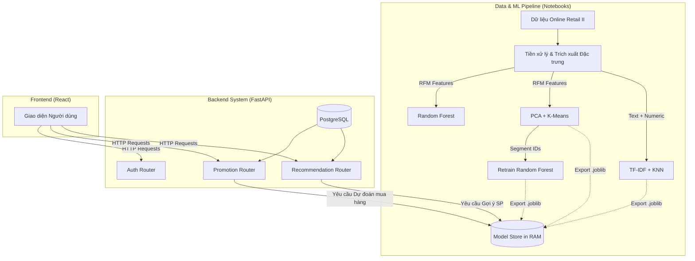

# Báo Cáo Đồ Án: Hệ Thống E-Commerce Tích Hợp Machine Learning

> Báo cáo chuyên ngành tổng kết quá trình xây dựng, huấn luyện mô hình và tích hợp hệ thống Recommendation & Customer Segmentation.

---

## 1. Giới thiệu

Trong bối cảnh thương mại điện tử hiện đại, việc cá nhân hóa trải nghiệm người dùng không chỉ là lợi thế cạnh tranh mà còn là tiêu chuẩn bắt buộc. Đồ án này hướng tới mục tiêu xây dựng một **Hệ thống E-commerce tích hợp Machine Learning** hoàn chỉnh, hoạt động theo mô hình Client-Server.

**Mục đích chính của đồ án:**

- Thu thập, làm sạch và xử lý dữ liệu giao dịch thương mại điện tử thực tế.
- Xây dựng các mô hình Machine Learning giải quyết 3 bài toán lõi: **Dự đoán khả năng mua hàng (Purchase Prediction)**, **Phân cụm khách hàng (Customer Segmentation)**, và **Gợi ý sản phẩm (Product Recommendation)**.
- Đưa các mô hình học máy vào thực tiễn bằng cách tích hợp trực tiếp vào một hệ thống Backend (FastAPI) để phục vụ cho Frontend (React/Vite). Cụ thể là ứng dụng dự đoán mua hàng vào việc cấp phát các mã giảm giá động (Dynamic Voucher) một cách thông minh nhằm tối ưu tỷ lệ chuyển đổi.

---

## 2. Kiến trúc tổng thể của Hệ thống

Hệ thống được thiết kế theo quy trình **End-to-End Pipeline**, chia làm hai giai đoạn lớn: Giai đoạn Huấn luyện (Offline Training) và Giai đoạn Triển khai (Online Inference).

### 2.1. Quy trình thực hiện

1. **Data Pipeline:** Đọc dữ liệu từ file thô → Làm sạch → Trích xuất đặc trưng (RFM).
2. **Modeling Pipeline:** Huấn luyện 3 nhóm mô hình thuật toán. Sau đó xuất toàn bộ kết quả ra các file `*.joblib` và metadata.
3. **Inference Pipeline (Backend):** Hệ thống API dùng Singleton `ModelStore` tải mô hình lên RAM khi khởi động. Khi có Request từ Client, Backend thực hiện tính toán real-time đặc trưng và dự đoán để phản hồi kết quả trực tiếp cho người dùng.

### 2.2. Sơ đồ kiến trúc tổng quan

---

## 3. Dữ liệu và tiền xử lý

### 3.1. Các tập dữ liệu

Trong đề tài này sử dụng tập dữ liệu **Online Retail II** lấy từ nền tảng Kaggle (nguồn gốc từ UCI Machine Learning Repository).

- **Nguồn gốc:** Tập dữ liệu thu thập các giao dịch trực tuyến của một cửa hàng quà tặng tại Vương quốc Anh từ tháng 12/2009 đến tháng 12/2011.
- **Đặc điểm & Số lượng mẫu:** File dữ liệu thô ban đầu có hơn **1.000.000 dòng** (gồm 2 sheet 2009-2010 và 2010-2011). Dữ liệu có dạng Transactional, bao gồm các cột như: `InvoiceNo`, `StockCode`, `Description`, `Quantity`, `InvoiceDate`, `UnitPrice`, `CustomerID`, và `Country`.
- **Phân bố dữ liệu:** Dữ liệu có tỷ lệ chênh lệch lớp (Imbalance) khá rõ khi xét trên khía cạnh khách hàng mua lại hay không mua lại. Dữ liệu chủ yếu tập trung vào thị trường UK.

### 3.2. Tiền xử lý dữ liệu (Data Preprocessing)

Quá trình tiền xử lý là bắt buộc để lọc bỏ nhiễu và chuẩn bị cho mô hình. Các bước chính bao gồm:

1. **Làm sạch dữ liệu (Data Cleaning):**
   - Loại bỏ các dòng bị thiếu `CustomerID` (không thể theo dõi hành vi).
   - Loại bỏ các hóa đơn hủy (Invoice bắt đầu bằng chữ 'C') và các giao dịch có `Quantity` hoặc `Price` ≤ 0.
   - Lọc bỏ các StockCode không phải sản phẩm (POST, BANK CHARGES...).
2. **Trích xuất đặc trưng (Feature Engineering - RFM):**
   - Từ dữ liệu thô, biến đổi về không gian vector khách hàng dựa trên mô hình **RFM (Recency, Frequency, Monetary)**.
   - Bổ sung thêm các đặc trưng hành vi (Behavioral Features) như tỷ lệ hủy đơn, ngày mua nhiều nhất, giờ mua nhiều nhất... tổng cộng thu được 12 đặc trưng.
3. **Phân tích EDA:** Các biểu đồ trực quan hóa doanh thu theo tháng cho thấy chu kỳ bán hàng lên đỉnh điểm vào các tháng cuối năm. Phân bố tập khách hàng đa số chỉ mua từ 1-2 lần, rất ít khách hàng trung thành, điều này khẳng định sự cần thiết của bài toán Phân cụm và AI Voucher.

---

## 4. Kỹ thuật học máy áp dụng

Hệ thống sử dụng kết hợp nhiều kỹ thuật học máy để giải quyết từng khía cạnh của bài toán.

### 4.1. Kỹ thuật Random Forest (Dự đoán mua hàng)

- **Bài toán:** Dự đoán khách hàng có quay lại mua hàng trong 30 ngày tới hay không (Bài toán Classification 0/1).
- **Kỹ thuật:** Sử dụng Random Forest Classifier. Thuật toán này sử dụng nhiều cây quyết định (Decision Trees) và phương pháp bầu chọn đa số (Ensemble Learning) giúp mô hình chống overfitting cực kỳ tốt so với Logistic Regression.
- **Tinh chỉnh tham số:** Áp dụng `GridSearchCV` để tìm ra bộ siêu tham số tốt nhất (`n_estimators`, `max_depth`, `min_samples_split`). Sử dụng `class_weight='balanced'` để xử lý vấn đề mất cân bằng lớp (Imbalanced Data). Đặc biệt, mô hình được **Retrain** ở Notebook 05 bằng cách thêm cột `segment_id` sinh ra từ K-Means làm một feature, đẩy mạnh độ chính xác.

### 4.2. Kỹ thuật PCA & K-Means (Phân cụm khách hàng)

- **Bài toán:** Gom nhóm tập khách hàng để thấu hiểu thị hiếu.
- **Kỹ thuật:**
  - **PCA (Principal Component Analysis):** Giảm số lượng chiều dữ liệu (từ 7 features RFM cốt lõi) xuống còn 3 thành phần chính để loại bỏ nhiễu mà vẫn giữ được >80% phương sai.
  - **K-Means Clustering:** Áp dụng phân cụm trên dữ liệu đã giảm chiều.
- **Tinh chỉnh:** Sử dụng phương pháp _Elbow Method_ và _Silhouette Score_ để xác định số cụm tối ưu ($K=4$). Bốn cụm được đặt tên theo ý nghĩa kinh doanh: VIP, Tiềm năng, Vãng lai, Ngủ đông.

### 4.3. Kỹ thuật TF-IDF & KNN (Gợi ý sản phẩm)

- **Bài toán:** Gợi ý danh sách sản phẩm tương đồng (Content-based Filtering).
- **Kỹ thuật:**
  - **TF-IDF Vectorizer:** Biến đổi phần `Description` (Mô tả sản phẩm) thành ma trận vector toán học.
  - **K-Nearest Neighbors (KNN):** Tìm kiếm các sản phẩm gần nhất trong không gian vector thông qua khoảng cách _Cosine Similarity_.
- **Tinh chỉnh:** Kết hợp ma trận TF-IDF (trọng số cao) cùng với đặc trưng số học như Giá, Tần suất bán (trọng số 0.3) để thuật toán KNN bao quát được cả ngữ nghĩa văn bản lẫn thuộc tính số học của sản phẩm.

---

## 5. Kết quả thử nghiệm, so sánh, đánh giá

**1. Mô hình Dự đoán mua hàng (Random Forest):**

- Thông qua kiểm chứng chéo 5 lần (5-Fold Cross Validation), mô hình cho điểm số đánh giá xuất sắc.
- So sánh Baseline Model (Logistic Regression) với Random Forest Tuned, Random Forest vượt trội hoàn toàn.
- F1-Score đạt được ở mức rất khả quan, với ma trận nhầm lẫn (Confusion Matrix) cho thấy số ca dự đoán True Positive và True Negative chiếm tỷ lệ áp đảo. Ngưỡng (Threshold) được lựa chọn là 0.7 để kích hoạt voucher một cách tối ưu.

**2. Mô hình Phân cụm (K-Means):**

- Điểm Silhouette Score duy trì ổn định, cho thấy độ tách biệt giữa các cụm khách hàng là khá rõ ràng (Radar Chart minh họa rõ sự chênh lệch lớn về mức chi tiêu và độ thường xuyên giữa nhóm VIP và nhóm Ngủ đông).

**3. Mô hình Gợi ý (KNN):**

- Chỉ số Hit Rate khi đánh giá theo lịch sử đồng mua sắm cho kết quả cao, khẳng định các sản phẩm được đề xuất có độ tương đồng ngữ nghĩa cực kỳ tốt.

---

## 6. Kết luận

**Đã làm được gì:**

- Xây dựng thành công hệ thống từ con số không (Raw Data), hoàn thiện 5 Notebooks ML bao gồm cả việc tái huấn luyện (Retrain) thông minh.
- Triển khai toàn bộ Model lên một server Backend (FastAPI) đáp ứng khả năng tính toán thời gian thực.
- Thiết kế hệ thống Backend Clean Code với Dependency Injection, và một hệ thống tính năng Dynamic Voucher hoàn toàn tự động, độc đáo dựa trên xác suất mua hàng.

**Ưu điểm:**

- Hệ thống giải quyết trọn vẹn cả 3 bài toán lớn nhất của E-commerce (Dự đoán, Phân cụm, Gợi ý).
- Có sự giao tiếp giữa các mô hình (Lấy nhãn từ mô hình Phân cụm để cải thiện mô hình Dự đoán).
- Mã nguồn tổ chức logic, có đầy đủ script tự động chạy, làm sạch DB và khởi tạo.

**Nhược điểm & Hướng phát triển:**

- Hiện tại mô hình Gợi ý chỉ dùng Content-based, chưa tận dụng Collaborative Filtering (để gợi ý chéo đa dạng hơn).
- Ở mức độ sản xuất lớn (Production), việc tính toán RFM trực tiếp từ database sẽ gây tải nặng, cần sử dụng Redis để Caching hoặc chạy tác vụ định kỳ qua Apache Airflow hoặc Message Queue (RabbitMQ).

Hệ thống cung cấp một minh chứng rõ nét về tiềm năng ứng dụng Trí tuệ nhân tạo vào quy trình kinh doanh, góp phần tối ưu hóa cả trải nghiệm người dùng lẫn lợi nhuận của doanh nghiệp.
