# Báo Cáo Đồ Án: Hệ Thống E-Commerce Tích Hợp Machine Learning

> Báo cáo chuyên ngành tổng kết quá trình xây dựng, huấn luyện mô hình và tích hợp hệ thống Recommendation & Customer Segmentation.

---

## 1. Giới thiệu

Trong bối cảnh thương mại điện tử hiện đại, việc cá nhân hóa trải nghiệm người dùng không chỉ là lợi thế cạnh tranh mà còn là tiêu chuẩn bắt buộc. Đồ án này hướng tới mục tiêu xây dựng một **Hệ thống E-commerce tích hợp Machine Learning** hoàn chỉnh, hoạt động theo mô hình Client-Server.

**Mục đích chính của đồ án:**

- Thu thập, làm sạch và xử lý dữ liệu giao dịch thương mại điện tử thực tế.
- Xây dựng các mô hình Machine Learning giải quyết 3 bài toán lõi: **Dự đoán khả năng mua hàng (Purchase Prediction)**, **Phân cụm khách hàng (Customer Segmentation)**, và **Gợi ý sản phẩm (Product Recommendation)**.
- Đưa các mô hình học máy vào thực tiễn bằng cách tích hợp trực tiếp vào một hệ thống Backend (FastAPI) để phục vụ cho Frontend (React/Vite). Cụ thể là ứng dụng dự đoán mua hàng vào việc cấp phát các mã giảm giá động (Dynamic Voucher) một cách thông minh nhằm tối ưu tỷ lệ chuyển đổi.

---

## 2. Kiến trúc tổng thể của Hệ thống

Hệ thống được thiết kế theo quy trình **End-to-End Pipeline**, chia làm hai giai đoạn lớn: Giai đoạn Huấn luyện (Offline Training) và Giai đoạn Triển khai (Online Inference).

### Quy trình thực hiện

1. **Data Pipeline:** Đọc dữ liệu từ file thô → Làm sạch → Trích xuất đặc trưng (RFM).
2. **Modeling Pipeline:** Huấn luyện 3 nhóm mô hình thuật toán. Sau đó xuất toàn bộ kết quả ra các file `*.joblib` và metadata.
3. **Inference Pipeline (Backend):** Hệ thống API dùng Singleton `ModelStore` tải mô hình lên RAM khi khởi động. Khi có Request từ Client, Backend thực hiện tính toán real-time đặc trưng và dự đoán để phản hồi kết quả trực tiếp cho người dùng.

---

## 3. Dữ liệu và tiền xử lý

### 3.1. Các tập dữ liệu

Trong đề tài này sử dụng tập dữ liệu **Online Retail II** lấy từ nền tảng Kaggle (nguồn gốc từ UCI Machine Learning Repository).

- **Nguồn gốc:** Tập dữ liệu thu thập các giao dịch trực tuyến của một cửa hàng quà tặng tại Vương quốc Anh từ tháng 12/2009 đến tháng 12/2011.
- **Đặc điểm & Số lượng mẫu:** File dữ liệu thô ban đầu có **1,067,371 dòng** với 8 cột, chiếm **249.1 MB** bộ nhớ. Dữ liệu có dạng Transactional, bao gồm các cột: `Invoice`, `StockCode`, `Description`, `Quantity`, `InvoiceDate`, `Price`, `Customer ID`, và `Country`.

**Bảng 1: Cấu trúc Dataset ban đầu**

| Cột         | Kiểu dữ liệu | Non-Null Count |
| ----------- | ------------ | -------------- |
| Invoice     | object       | 1,067,371      |
| StockCode   | object       | 1,067,371      |
| Description | object       | 1,062,989      |
| Quantity    | int64        | 1,067,371      |
| InvoiceDate | datetime64   | 1,067,371      |
| Price       | float64      | 1,067,371      |
| Customer ID | float64      | 824,364        |
| Country     | object       | 1,067,371      |

### 3.2. Phân tích giá trị thiếu (Missing Values)

Phân tích giá trị thiếu cho thấy hai cột bị ảnh hưởng, trong đó `Customer ID` là nghiêm trọng nhất:

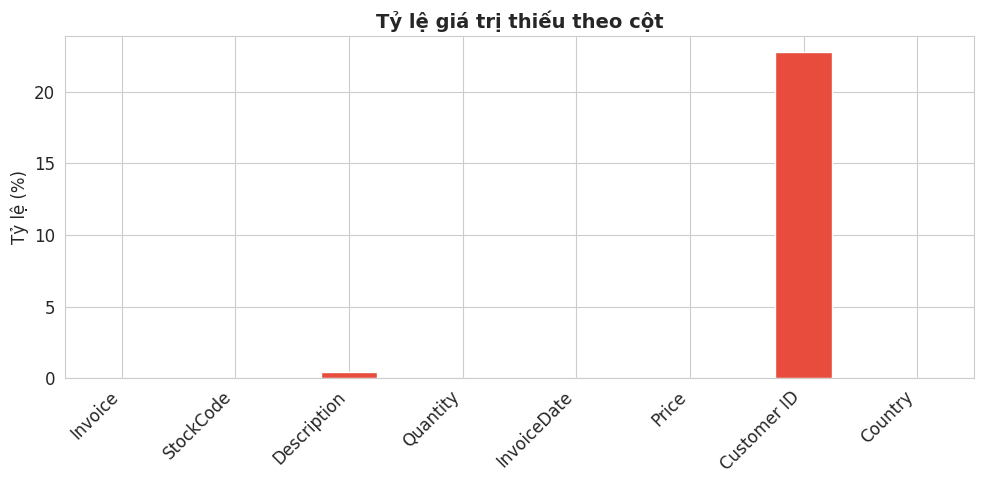

| Cột             | Số lượng thiếu | Tỷ lệ (%) |
| --------------- | -------------- | --------- |
| Customer ID     | 243,007        | 22.77%    |
| Description     | 4,382          | 0.41%     |
| Các cột còn lại | 0              | 0.00%     |

> **Nhận xét:** Gần 23% dữ liệu không có thông tin khách hàng, điều này ảnh hưởng trực tiếp đến khả năng xây dựng hồ sơ hành vi, nên bước làm sạch bắt buộc phải loại bỏ các dòng này.

### 3.3. Tiền xử lý dữ liệu (Data Preprocessing)

Quá trình tiền xử lý là bắt buộc để lọc bỏ nhiễu và chuẩn bị cho mô hình. Các bước chính và kết quả cụ thể:

**Bảng 2: Pipeline Làm sạch dữ liệu**

| Bước                                      | Dòng còn lại | Ghi chú               |
| ----------------------------------------- | ------------ | --------------------- |
| Dữ liệu ban đầu                           | 1,067,371    | —                     |
| Sau loại bỏ null Customer ID              | 824,364      | -22.77%               |
| Sau loại bỏ đơn hủy (Invoice bắt đầu 'C') | 805,620      |                       |
| Sau loại bỏ Quantity/Price ≤ 0            | 805,549      |                       |
| Sau loại bỏ StockCode không hợp lệ        | **802,679**  | POST, BANK CHARGES... |

> ✅ **Kết quả:** Dữ liệu sạch còn lại **802,679 dòng** (75.2% dữ liệu gốc), bao gồm **5,861 khách hàng** và **4,624 sản phẩm**, trong khoảng thời gian từ 2009-12-01 đến 2011-12-09.

### 3.4. Phân tích khám phá dữ liệu (EDA)

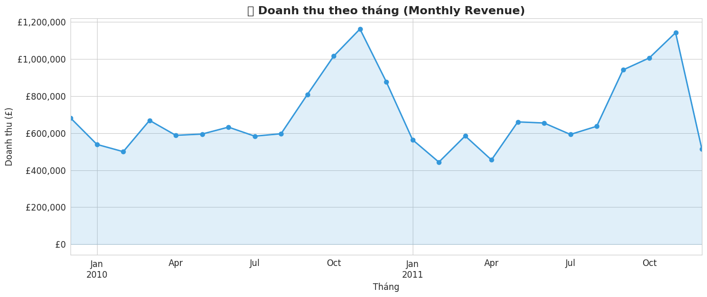
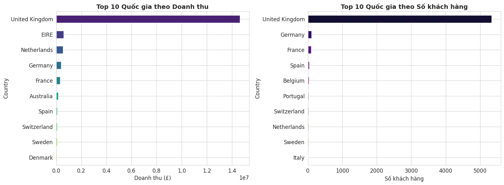
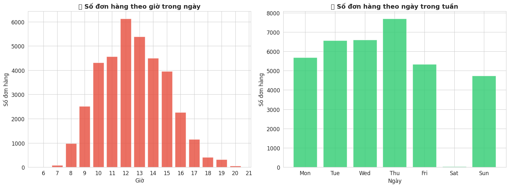

#### a) Top 10 sản phẩm bán chạy nhất

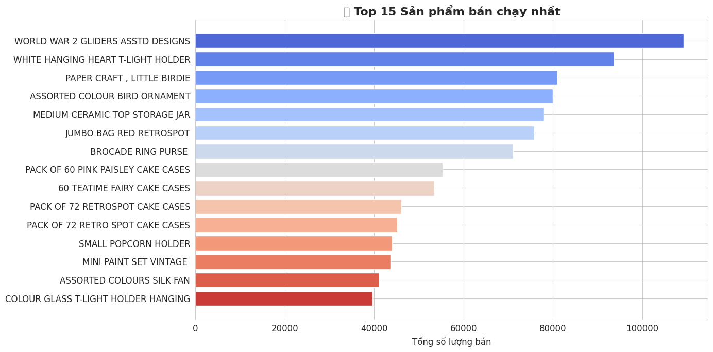

| Hạng | StockCode | Mô tả                              | Tổng SL | Doanh thu (£) | Số đơn |
| ---- | --------- | ---------------------------------- | ------- | ------------- | ------ |
| 1    | 84077     | WORLD WAR 2 GLIDERS ASSTD DESIGNS  | 109,169 | 24,905.87     | 920    |
| 2    | 85123A    | WHITE HANGING HEART T-LIGHT HOLDER | 93,640  | 252,072.46    | 4,888  |
| 3    | 23843     | PAPER CRAFT, LITTLE BIRDIE         | 80,995  | 168,469.60    | 1      |
| 4    | 84879     | ASSORTED COLOUR BIRD ORNAMENT      | 79,913  | 127,074.17    | 2,652  |
| 5    | 23166     | MEDIUM CERAMIC TOP STORAGE JAR     | 77,916  | 81,416.73     | 195    |
| 6    | 85099B    | JUMBO BAG RED RETROSPOT            | 75,759  | 136,980.08    | 2,612  |
| 7    | 17003     | BROCADE RING PURSE                 | 71,129  | 14,827.71     | 387    |
| 8    | 21977     | PACK OF 60 PINK PAISLEY CAKE CASES | 55,270  | 26,733.45     | 1,578  |
| 9    | 84991     | 60 TEATIME FAIRY CAKE CASES        | 53,495  | 26,121.57     | 1,765  |
| 10   | 21212     | PACK OF 72 RETROSPOT CAKE CASES    | 46,107  | 22,214.26     | 1,348  |

#### b) Thống kê giá trị đơn hàng

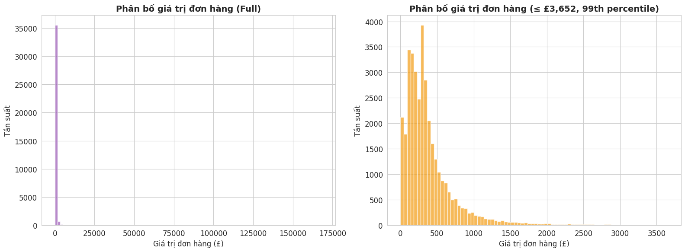

| Chỉ số                  | Giá trị     |
| ----------------------- | ----------- |
| Trung bình (Mean)       | £475.97     |
| Trung vị (Median)       | £304.50     |
| Giá trị thấp nhất (Min) | £0.38       |
| Giá trị cao nhất (Max)  | £168,469.60 |

#### c) Phân bố tần suất mua hàng của khách

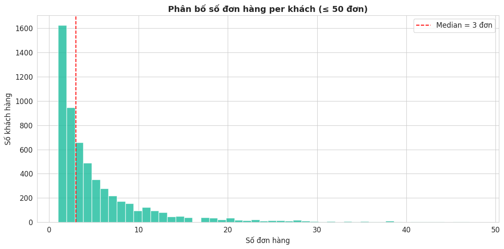

| Phân loại           | Số lượng khách | Tỷ lệ |
| ------------------- | -------------- | ----- |
| Khách chỉ mua 1 lần | 1,625          | 27.7% |
| Khách mua > 1 lần   | 4,236          | 72.3% |
| Khách mua > 10 lần  | 866            | 14.8% |

> **Nhận xét:** Đa số khách hàng (72.3%) có xu hướng quay lại mua hàng, tuy nhiên có đến 27.7% chỉ mua duy nhất một lần. Điều này khẳng định sự cần thiết của bài toán Dự đoán mua hàng và hệ thống Dynamic Voucher.

### 3.5. Trích xuất đặc trưng (Feature Engineering)

Từ dữ liệu sạch, tiến hành trích xuất **12 đặc trưng** cho mỗi khách hàng dựa trên mô hình **RFM mở rộng** (Recency, Frequency, Monetary + Behavioral Features).

Biến mục tiêu `will_purchase` được xây dựng bằng cách chia dữ liệu theo mốc thời gian: Training period trước 30/06/2011 và Prediction period sau đó.

**Phân bố biến mục tiêu (Target Variable):**

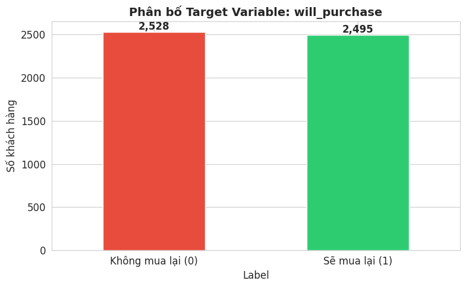

| Nhãn | Ý nghĩa             | Số lượng | Tỷ lệ     |
| ---- | ------------------- | -------- | --------- |
| 1    | Sẽ mua lại          | 2,528    | 50.3%     |
| 0    | Không mua lại       | 2,495    | 49.7%     |
|      | **Tỷ lệ imbalance** |          | **1:1.0** |

> ✅ **Nhận xét:** Dữ liệu target gần như cân bằng hoàn hảo (50/50), thuận lợi cho việc huấn luyện mô hình phân loại mà không cần đến các kỹ thuật xử lý imbalance phức tạp.

**Bảng 3: Tương quan của các đặc trưng với biến mục tiêu `will_purchase`**

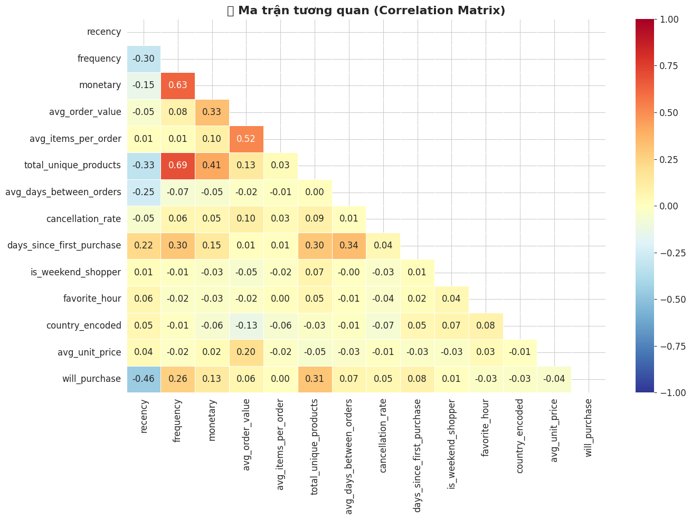

| Đặc trưng                 | Hệ số tương quan | Hướng     |
| ------------------------- | ---------------- | --------- |
| recency                   | -0.456           | ⬇️ Nghịch |
| total_unique_products     | +0.307           | ⬆️ Thuận  |
| frequency                 | +0.259           | ⬆️ Thuận  |
| monetary                  | +0.131           | ⬆️ Thuận  |
| days_since_first_purchase | +0.084           | ⬆️ Thuận  |
| avg_days_between_orders   | +0.066           | ⬆️ Thuận  |
| avg_order_value           | +0.057           | ⬆️ Thuận  |
| cancellation_rate         | +0.046           | ⬆️ Thuận  |
| avg_unit_price            | -0.043           | ⬇️ Nghịch |
| favorite_hour             | -0.030           | ⬇️ Nghịch |
| country_encoded           | -0.029           | ⬇️ Nghịch |
| is_weekend_shopper        | +0.007           | —         |
| avg_items_per_order       | +0.001           | —         |

> **Nhận xét quan trọng:**
>
> - Đặc trưng **recency** (thời gian kể từ lần mua cuối) có tương quan nghịch mạnh nhất (-0.456), nghĩa là khách mua gần đây nhất có khả năng mua lại cao nhất.
> - **total_unique_products** (+0.307) và **frequency** (+0.259) cũng là các features quan trọng, cho thấy khách hàng đa dạng sản phẩm và mua thường xuyên có xu hướng quay lại.

**Biểu đồ phân bố đặc trưng theo biến mục tiêu (Feature Distribution by Target)**

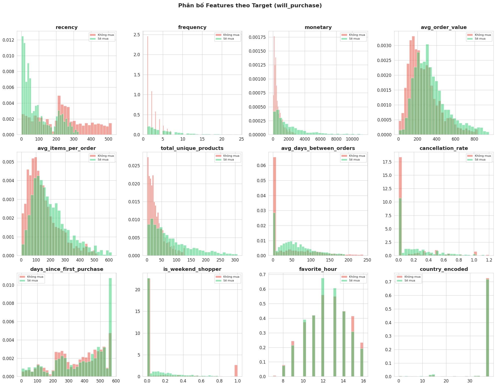

Biểu đồ trên so sánh phân bố mật độ (Density) của 12 đặc trưng giữa hai nhóm khách hàng: **Sẽ mua lại (xanh lá)** và **Không mua lại (đỏ)**. Trục X thể hiện giá trị thực tế của từng đặc trưng, trục Y thể hiện mật độ xác suất (đã chuẩn hóa để tổng diện tích dưới đường cong bằng 1). Phân tích chi tiết từng feature:

| #   | Đặc trưng                     | Nhận xét                                                                                                                                                                   |
| --- | ----------------------------- | -------------------------------------------------------------------------------------------------------------------------------------------------------------------------- |
| 1   | **recency**                   | Nhóm "Sẽ mua" tập trung mạnh ở giá trị thấp (0–50 ngày), nhóm "Không mua" phân bố trải rộng ở giá trị cao (200–500 ngày). Đây là đặc trưng có tính phân tách rõ ràng nhất. |
| 2   | **frequency**                 | Nhóm "Không mua" có tần suất rất thấp (1–2 lần), nhóm "Sẽ mua" phân bố rộng hơn ở tần suất cao (5–15 lần).                                                                 |
| 3   | **monetary**                  | Cả hai nhóm tập trung ở giá trị thấp, nhưng nhóm "Sẽ mua" có đuôi phân bố dài hơn (chi tiêu cao hơn).                                                                      |
| 4   | **avg_order_value**           | Phân bố tương đối giống nhau giữa hai nhóm, cho thấy giá trị đơn hàng trung bình không phải đặc trưng phân tách mạnh.                                                      |
| 5   | **avg_items_per_order**       | Hai nhóm gần như trùng lắp, đặc trưng này ít có giá trị phân biệt.                                                                                                         |
| 6   | **total_unique_products**     | Nhóm "Sẽ mua" có xu hướng sở hữu nhiều sản phẩm đa dạng hơn, phân bố lệch phải so với nhóm "Không mua".                                                                    |
| 7   | **avg_days_between_orders**   | Nhóm "Sẽ mua" tập trung ở giá trị thấp (quay lại nhanh hơn), nhóm "Không mua" phân bố rải ở khoảng cách dài.                                                               |
| 8   | **cancellation_rate**         | Đa số khách hàng ở cả hai nhóm có tỷ lệ hủy đơn rất thấp (0–0.2). Nhóm "Không mua" có một số ngoại lệ với tỷ lệ hủy cao.                                                   |
| 9   | **days_since_first_purchase** | Nhóm "Sẽ mua" phân bố rộng ở 100–550 ngày (khách "lâu năm" có xu hướng quay lại), nhóm "Không mua" tập trung ở giá trị thấp hơn.                                           |
| 10  | **is_weekend_shopper**        | Phân bố gần như đồng nhất giữa hai nhóm, mua sắm cuối tuần không phải yếu tố quyết định.                                                                                   |
| 11  | **favorite_hour**             | Cả hai nhóm tập trung ở khung giờ 10h–14h, không có sự phân tách đáng kể.                                                                                                  |
| 12  | **country_encoded**           | Phần lớn khách hàng cả hai nhóm tập trung ở mã quốc gia đầu (United Kingdom), đặc trưng này ít ảnh hưởng đến kết quả dự đoán.                                              |

> **Kết luận:** Các đặc trưng **recency**, **frequency**, **total_unique_products** và **avg_days_between_orders** cho thấy khả năng phân tách rõ rệt nhất giữa hai lớp, phù hợp với kết quả phân tích tương quan ở bảng trên.

---

## 4. Kỹ thuật học máy áp dụng

Hệ thống sử dụng kết hợp nhiều kỹ thuật học máy để giải quyết từng khía cạnh của bài toán.

### 4.1. Kỹ thuật Random Forest (Dự đoán mua hàng)

- **Bài toán:** Dự đoán khách hàng có quay lại mua hàng trong 30 ngày tới hay không (Bài toán Classification 0/1).
- **Kỹ thuật:** Sử dụng Random Forest Classifier. Thuật toán này sử dụng nhiều cây quyết định (Decision Trees) và phương pháp bầu chọn đa số (Ensemble Learning) giúp mô hình chống overfitting cực kỳ tốt so với Logistic Regression.
- **Tinh chỉnh tham số:** Áp dụng `GridSearchCV` để tìm ra bộ siêu tham số tốt nhất (`n_estimators`, `max_depth`, `min_samples_split`). Sử dụng `class_weight='balanced'` để xử lý vấn đề mất cân bằng lớp (Imbalanced Data). Đặc biệt, mô hình được **Retrain** ở Notebook 05 bằng cách thêm cột `segment_id` sinh ra từ K-Means làm một feature, đẩy mạnh độ chính xác.

### 4.2. Kỹ thuật PCA & K-Means (Phân cụm khách hàng)

- **Bài toán:** Gom nhóm tập khách hàng để thấu hiểu thị hiếu.
- **Kỹ thuật:**
  - **PCA (Principal Component Analysis):** Giảm số lượng chiều dữ liệu (từ 7 features RFM cốt lõi) xuống còn 3 thành phần chính để loại bỏ nhiễu mà vẫn giữ được >80% phương sai.
  - **K-Means Clustering:** Áp dụng phân cụm trên dữ liệu đã giảm chiều.
- **Tinh chỉnh:** Sử dụng phương pháp _Elbow Method_ và _Silhouette Score_ để xác định số cụm tối ưu ($K=4$). Bốn cụm được đặt tên theo ý nghĩa kinh doanh: VIP, Tiềm năng, Vãng lai, Ngủ đông.

### 4.3. Kỹ thuật TF-IDF & KNN (Gợi ý sản phẩm)

- **Bài toán:** Gợi ý danh sách sản phẩm tương đồng (Content-based Filtering).
- **Kỹ thuật:**
  - **TF-IDF Vectorizer:** Biến đổi phần `Description` (Mô tả sản phẩm) thành ma trận vector toán học.
  - **K-Nearest Neighbors (KNN):** Tìm kiếm các sản phẩm gần nhất trong không gian vector thông qua khoảng cách _Cosine Similarity_.
- **Tinh chỉnh:** Kết hợp ma trận TF-IDF (trọng số cao) cùng với đặc trưng số học như Giá, Tần suất bán (trọng số 0.3) để thuật toán KNN bao quát được cả ngữ nghĩa văn bản lẫn thuộc tính số học của sản phẩm.

---

## 5. Kết quả thử nghiệm, so sánh, đánh giá

### 5.1. Mô hình Dự đoán mua hàng (Random Forest)

Tiến hành đánh giá mô hình phân loại với mục tiêu dự đoán khách hàng có mua lại hay không.

**a) So sánh các mô hình (Model Comparison)**

Hệ thống đã thử nghiệm 3 cấu hình khác nhau: Baseline (Logistic Regression), Random Forest (Mặc định) và Random Forest (Tuned qua GridSearchCV).

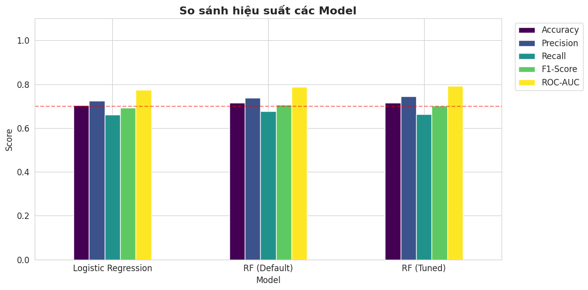

_Kết quả tốt nhất:_ Mô hình **Random Forest (Tuned)** đạt độ đo ROC-AUC cao nhất (0.7931), F1-Score (0.7022). Siêu tham số tối ưu tìm được: `max_depth=10, min_samples_leaf=4, n_estimators=100, class_weight='balanced'`.

**Bảng 4: Tổng hợp hiệu suất các mô hình trên tập Test (1,005 mẫu)**

| Mô hình             | Accuracy   | Precision  | Recall     | F1-Score   | ROC-AUC    |
| ------------------- | ---------- | ---------- | ---------- | ---------- | ---------- |
| Logistic Regression | 0.7035     | 0.7251     | 0.6621     | 0.6921     | 0.7749     |
| RF (Default)        | 0.7164     | 0.7387     | 0.6759     | 0.7059     | 0.7879     |
| **RF (Tuned)**      | **0.7164** | **0.7450** | **0.6640** | **0.7022** | **0.7931** |

> **Giải thích các chỉ số:**
>
> - **Precision (Độ chính xác):** Trong số khách hàng mà mô hình dự đoán "Sẽ mua", bao nhiêu % thực sự mua lại. Precision cao giúp tránh việc phát voucher sai người (tiết kiệm chi phí marketing).
> - **Recall (Độ phủ):** Trong số khách hàng thực sự mua lại, mô hình phát hiện được bao nhiêu %. Recall cao giúp không bỏ sót khách hàng tiềm năng.
> - **F1-Score:** Điểm trung bình hài hòa (Harmonic Mean) của Precision và Recall, đại diện cho năng lực tổng thể của mô hình.
> - **Support:** Số lượng mẫu thực tế thuộc mỗi class trong tập Test (Không mua: 499, Sẽ mua: 506).

**Bảng 5: Classification Report chi tiết — Random Forest (Tuned)**

| Class         | Precision | Recall | F1-Score | Support  |
| ------------- | --------- | ------ | -------- | -------- |
| Không mua (0) | 0.69      | 0.77   | 0.73     | 499      |
| Sẽ mua (1)    | 0.75      | 0.66   | 0.70     | 506      |
| **Accuracy**  |           |        | **0.72** | **1005** |
| Macro avg     | 0.72      | 0.72   | 0.72     | 1005     |
| Weighted avg  | 0.72      | 0.72   | 0.72     | 1005     |

**c) Phân tích chi tiết lỗi (Confusion Matrix & ROC/PR Curves)**

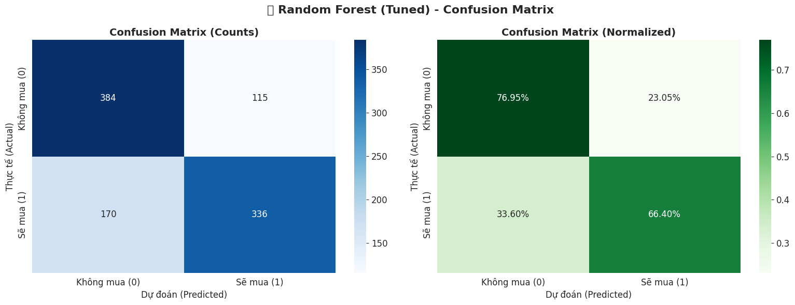
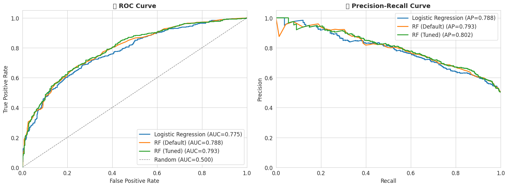

Ma trận nhầm lẫn minh hoạ số lượng dự đoán đúng trên tập Test:

- **True Positives (TP - 336):** Dự đoán khách sẽ mua, thực tế có mua.
- **True Negatives (TN - 384):** Dự đoán không mua, thực tế không mua.
  Đường cong ROC và Precision-Recall thể hiện khả năng phân tách tốt giữa hai lớp, cho thấy hiệu suất thuật toán rất ổn định, diện tích dưới đường cong lớn.

**d) Độ quan trọng của các đặc trưng (Feature Importance)**

Việc tìm hiểu thuật toán Random Forest ưu tiên đặc trưng nào giúp bộ phận kinh doanh có cái nhìn sâu sắc hơn về hành vi khách hàng.

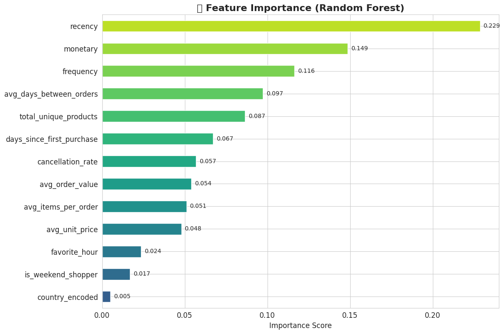

Top các đặc trưng có tính quyết định cao nhất:

1. **Recency (22.86%)**
2. **Monetary (14.86%)**
3. **Frequency (11.64%)**

Điều này tái khẳng định mô hình RFM hoàn toàn phù hợp để biểu diễn mức độ trung thành của khách hàng.

**e) Phân tích Phân bổ Xác suất và Tối ưu hóa ngưỡng dự đoán (Probability Distribution & Threshold Optimization)**

Trong bài toán cấp phát Dynamic Voucher, ngưỡng phân loại mặc định (0.5) không nhất thiết là tối ưu. Mô hình Random Forest không chỉ trả về nhãn (0/1) mà còn cho ra **xác suất dự đoán** (probability) — con số cho biết mức độ tự tin của thuật toán đối với từng khách hàng cụ thể.

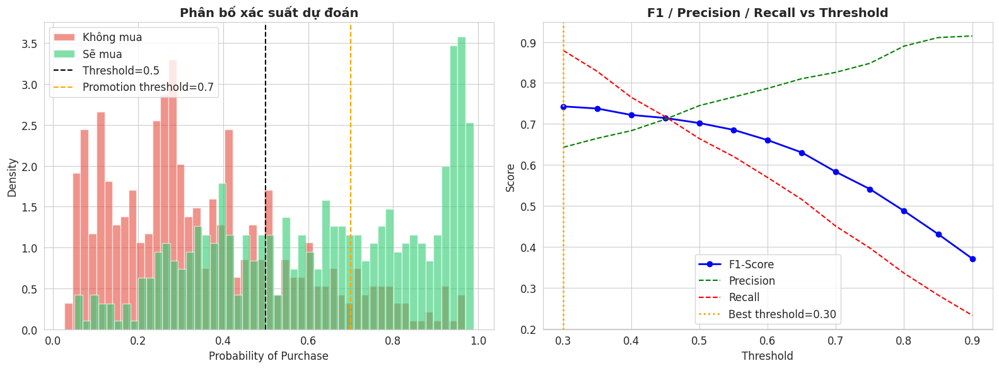

Biểu đồ trên bao gồm 3 phần phân tích quan trọng:

- **Biểu đồ trái — Probability Distribution:** Hiển thị phân bố xác suất mà mô hình gán cho hai nhóm khách hàng. Nhóm "Sẽ mua" (xanh) có xu hướng tập trung ở vùng xác suất cao, trong khi nhóm "Không mua" (đỏ) tập trung ở vùng xác suất thấp. Vùng giao nhau giữa hai phân bố chính là nơi mô hình dễ dự đoán sai nhất.
- **Biểu đồ giữa — F1/Precision/Recall vs Threshold:** Cho thấy mối quan hệ đánh đổi (trade-off) giữa Precision và Recall khi thay đổi ngưỡng (Threshold). Khi Threshold tăng, Precision tăng nhưng Recall giảm (và ngược lại). Đường F1-Score đạt **đỉnh tại Threshold = 0.30**, đây chính là điểm vận hành tối ưu (Optimal Operating Point) cân bằng tốt nhất giữa việc không bỏ sót khách hàng và không dự đoán sai.
- **Biểu đồ phải — Cumulative Response Curve:** Thể hiện tỷ lệ % khách hàng tiềm năng được phát hiện khi ta duyệt từ nhóm có xác suất cao xuống thấp.

**Ý nghĩa kinh doanh của ngưỡng 0.30:**

Dựa trên phân tích F1-Score tối ưu, ngưỡng dự đoán tối ưu tìm được là **0.30** (F1 đạt 0.7429). Con số này cho thấy:

- Với đặc thù dữ liệu E-commerce, chỉ cần khách hàng đạt **30% xác suất mua lại** là đã đủ điều kiện để hệ thống backend kích hoạt chiến lược chăm sóc (gửi email, hiển thị voucher, gợi ý sản phẩm).
- Ngưỡng 0.30 thay vì 0.50 cho phép hệ thống **chủ động hơn** trong việc tiếp cận tập khách hàng "lưỡng lự" (on-the-fence) — những người có dấu hiệu mua hàng tiềm năng nhưng chưa chắc chắn.
- Đây là kỹ thuật **Threshold Moving** tiêu chuẩn trong ML, phù hợp với dữ liệu mua sắm thực tế vốn có xu hướng ép điểm xác suất xuống thấp.

### 5.2. Mô hình Phân cụm khách hàng (PCA + K-Means)

Mục tiêu là gom nhóm khách hàng theo hành vi mua sắm để xây dựng chiến lược tiếp cận phù hợp cho từng phân khúc.

**a) Giảm chiều dữ liệu bằng PCA**

Trước khi phân cụm, áp dụng PCA (Principal Component Analysis) để giảm từ 7 features RFM xuống 3 thành phần chính, giúp loại bỏ nhiễu và tăng hiệu quả phân cụm.

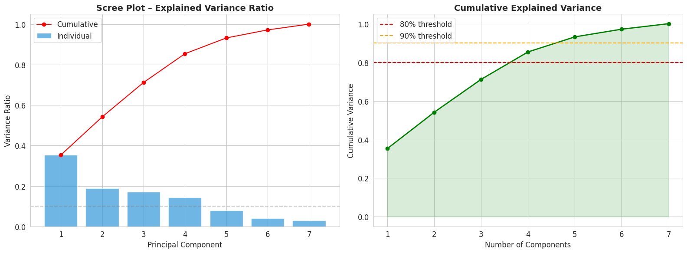

| Thành phần | Phương sai riêng | Phương sai tích lũy |
| ---------- | ---------------- | ------------------- |
| PC1        | 35.3%            | 35.3%               |
| PC2        | 18.8%            | 54.1%               |
| PC3        | 17.0%            | **71.2%**           |

> **Nhận xét:** 3 thành phần chính giữ lại 71.2% tổng phương sai — một mức hợp lý cho bài toán phân cụm, đủ để biểu diễn các pattern quan trọng nhất trong dữ liệu.

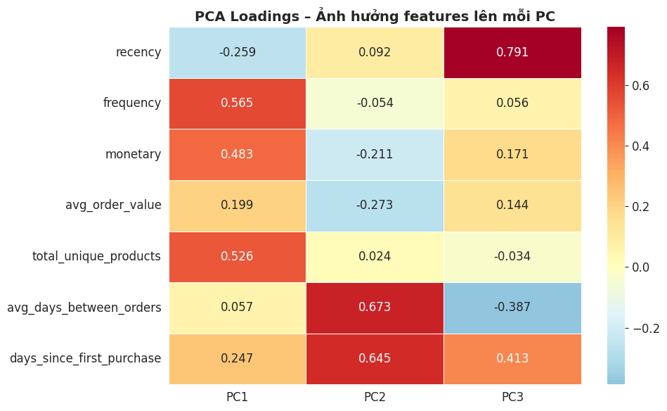

**b) Xác định số cụm tối ưu (Elbow Method + Silhouette)**

Sử dụng kết hợp 3 chỉ số: Inertia (Elbow), Silhouette Score và Davies-Bouldin Index để tìm số cụm tốt nhất.

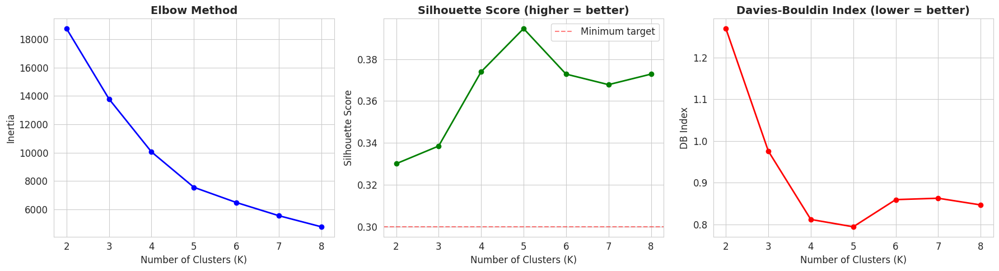

| K     | Inertia    | Silhouette | Davies-Bouldin |
| ----- | ---------- | ---------- | -------------- |
| 2     | 18,771     | 0.3301     | 1.2692         |
| 3     | 13,796     | 0.3385     | 0.9757         |
| **4** | **10,052** | **0.3740** | **0.8120**     |
| 5     | 7,545      | 0.3946     | 0.7945         |

> **Quyết định:** Mặc dù Silhouette gợi ý K=5, nhóm đồ án lựa chọn **K=4** theo business logic (VIP, Tiềm năng, Vãng lai, Ngủ đông) để phù hợp với chiến lược marketing thực tế.

**c) Kết quả phân cụm**

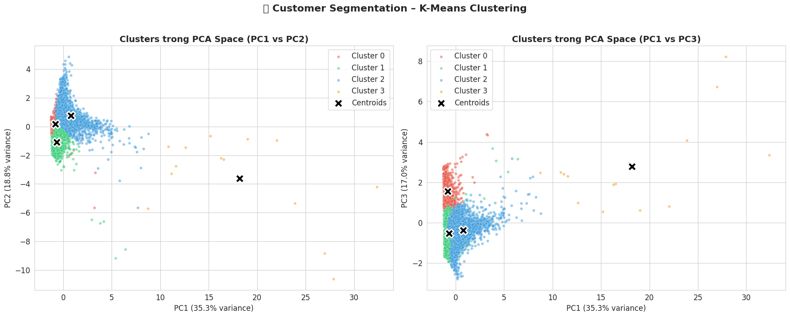
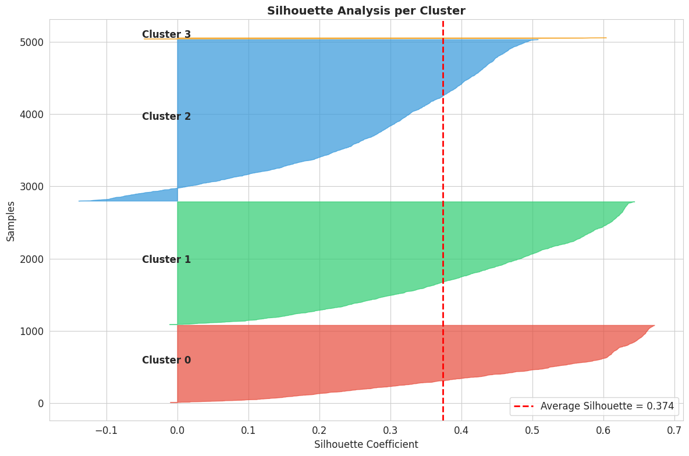

**Phân tích chi tiết biểu đồ Silhouette Analysis per Cluster:**

Biểu đồ Silhouette là công cụ trực quan hóa chất lượng phân cụm. Mỗi thanh ngang đại diện cho **1 điểm dữ liệu** (1 khách hàng), chiều dài thanh chính là **Silhouette Coefficient** của điểm đó.

**Silhouette Coefficient** cho mỗi điểm dữ liệu được tính theo công thức:

`s(i) = (b(i) - a(i)) / max(a(i), b(i))`

Trong đó:

- `a(i)`: khoảng cách trung bình từ điểm `i` đến **tất cả các điểm khác trong cùng cụm** (đo mức "gắn kết nội bộ")
- `b(i)`: khoảng cách trung bình nhỏ nhất từ điểm `i` đến **các điểm thuộc cụm gần nhất khác** (đo mức "tách biệt bên ngoài")

Giá trị Silhouette nằm trong khoảng **[-1, +1]**:

| Giá trị      | Ý nghĩa                                                                                             |
| ------------ | --------------------------------------------------------------------------------------------------- |
| **Gần +1**   | Điểm nằm **rất sâu** trong cụm của mình, xa cụm khác → phân cụm **tốt**                             |
| **Gần 0**    | Điểm nằm **trên ranh giới** giữa hai cụm → không rõ thuộc cụm nào                                   |
| **Âm (< 0)** | Điểm **gần cụm khác hơn** cụm được gán → có khả năng bị **phân cụm sai** hoặc thuộc vùng chồng chéo |

**Đường đỏ nét đứt — Average Silhouette = 0.374:**

Đường đỏ nét đứt thể hiện **giá trị Silhouette trung bình** của toàn bộ tập dữ liệu (5,023 khách hàng). Giá trị **0.374** mang ý nghĩa:

- Nằm trong khoảng **0.25 – 0.50**, được đánh giá là phân cụm ở mức **chấp nhận được** (reasonable structure). Các cụm có sự tách biệt nhưng vẫn còn vùng chồng chéo.
- Đây là mức phổ biến trong các bài toán phân khúc khách hàng thực tế, vì hành vi mua sắm vốn không có ranh giới cứng (hard boundary) mà mang tính liên tục (continuous spectrum).
- Con số 0.374 đóng vai trò **"benchmark nội bộ"** — nếu một cụm cụ thể có phần lớn các điểm dữ liệu vượt qua ngưỡng này (thanh dài hơn đường đỏ), cụm đó được coi là phân tách tốt; ngược lại, nếu nhiều điểm nằm dưới ngưỡng, cụm đó có vấn đề.

**Phân tích từng Cluster:**

| Cluster                                       | Nhận xét chi tiết                                                                                                                                                                                                                                                                                                                                                                                                                                                                                                                                                                                                                                                                                                                                                                            |
| --------------------------------------------- | -------------------------------------------------------------------------------------------------------------------------------------------------------------------------------------------------------------------------------------------------------------------------------------------------------------------------------------------------------------------------------------------------------------------------------------------------------------------------------------------------------------------------------------------------------------------------------------------------------------------------------------------------------------------------------------------------------------------------------------------------------------------------------------------- |
| **Cluster 0** (đỏ — 💤 Ngủ đông)              | Phân bố khá rộng (0.0 – 0.65), hình dáng tương đối đều. Phần lớn các điểm nằm trên hoặc gần ngưỡng 0.374, nghĩa là nhóm "Ngủ đông" có đặc trưng tương đối riêng biệt (recency rất cao ~410 ngày). Tuy nhiên, có một số ít điểm gần giá trị 0 — đây là các khách hàng ở "ranh giới" giữa Ngủ đông và Vãng lai.                                                                                                                                                                                                                                                                                                                                                                                                                                                                                |
| **Cluster 1** (xanh lá — 👋 Vãng lai)         | Hình dáng đều, hầu hết điểm có Silhouette > 0. Cluster này có sự phân tách tương đối tốt. Tuy nhiên, phần đáy (gần giá trị 0) cho thấy một bộ phận khách "Vãng lai" có hành vi tương tự nhóm "Tiềm năng" — khiến mô hình khó phân biệt rõ.                                                                                                                                                                                                                                                                                                                                                                                                                                                                                                                                                   |
| **Cluster 2** (xanh nước biển — 🌟 Tiềm năng) | **Đây là cluster lớn nhất (2,237 mẫu, 44.5%)** và cũng có **"đuôi nhọn" kéo sang trái vào vùng âm (~-0.15)**. Hiện tượng này xảy ra vì: (1) Cluster quá lớn nên chứa các khách hàng có hành vi đa dạng, từ khách mua tích cực đến khách đang chuyển giao; (2) Các điểm có giá trị Silhouette **âm** là những khách hàng **gần cụm khác hơn** cụm hiện tại — tức họ thực sự gần Cluster 0 (Ngủ đông) hoặc Cluster 1 (Vãng lai) hơn nhưng vẫn bị K-Means gán vào nhóm "Tiềm năng". Đây là các khách hàng ở **vùng chuyển giao** (transition zone) — ví dụ, khách vừa ngừng mua 1 thời gian nhưng trước đó rất tích cực, hoặc khách mới bắt đầu tăng tần suất mua. Phần "đuôi nhọn" âm là hoàn toàn bình thường trong thực tế và không ảnh hưởng nghiêm trọng đến chất lượng phân cụm tổng thể. |
| **Cluster 3** (cam — 🏆 VIP)                  | Rất mỏng vì chỉ có **15 mẫu (0.3%)**. Tuy ít điểm nhưng hầu hết có Silhouette cao (> 0.4), cho thấy nhóm VIP có đặc trưng **cực kỳ khác biệt** so với các nhóm còn lại (frequency ~129 lần, monetary ~£144K). Đây là cluster có chất lượng phân tách tốt nhất.                                                                                                                                                                                                                                                                                                                                                                                                                                                                                                                               |

> **Kết luận:** Average Silhouette = 0.374 xác nhận phân cụm K=4 là **hợp lý** cho dữ liệu khách hàng E-commerce. Phần "đuôi nhọn" âm ở Cluster 2 phản ánh bản chất tự nhiên của phân khúc khách hàng — không có ranh giới tuyệt đối giữa các nhóm, mà tồn tại một vùng chuyển giao liên tục. Trong ứng dụng thực tế, các khách hàng ở vùng chuyển giao này chính là đối tượng cần **theo dõi sát** vì họ có thể thăng hạng (lên VIP) hoặc rơi xuống (thành Ngủ đông) tùy thuộc vào chiến lược marketing.

**Bảng phân bố khách hàng theo cụm:**

| Segment | Tên gọi                   | Số lượng | Tỷ lệ | Recency  | Frequency | Monetary (£) |
| ------- | ------------------------- | -------- | ----- | -------- | --------- | ------------ |
| 0       | 💤 Ngủ đông (Hibernating) | 1,069    | 21.3% | 410 ngày | 2 lần     | £711         |
| 1       | 👋 Vãng lai (Casual)      | 1,702    | 33.9% | 139 ngày | 2 lần     | £793         |
| 2       | 🌟 Tiềm năng (Potential)  | 2,237    | 44.5% | 98 ngày  | 9 lần     | £3,703       |
| 3       | 🏆 VIP (Champions)        | 15       | 0.3%  | 19 ngày  | 129 lần   | £144,842     |

**d) So sánh đặc trưng giữa các phân khúc (Radar Chart & Feature Distribution)**

**Radar Chart — Cluster Profiles (Normalized):**

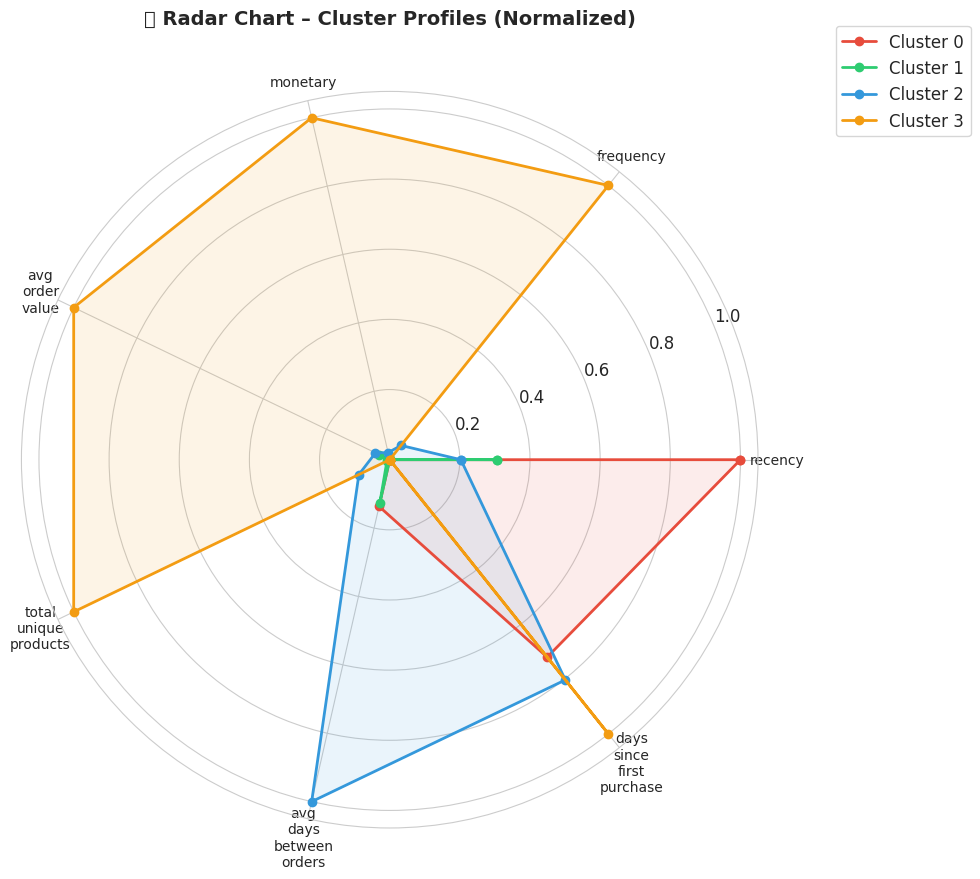

Biểu đồ Radar thể hiện **hồ sơ đặc trưng (profile) đã chuẩn hóa** của 4 phân khúc khách hàng trên 6 chiều: `recency`, `frequency`, `monetary`, `avg_order_value`, `total_unique_products`, `avg_days_between_orders`. Tất cả giá trị được **chuẩn hóa về thang [0, 1]** bằng Min-Max Scaling để so sánh tương đối giữa các cụm.

Cách đọc: mỗi trục đại diện cho 1 đặc trưng. Điểm **càng xa tâm** (gần 1.0) = giá trị **càng cao** so với toàn bộ tập dữ liệu. Diện tích vùng bao phủ phản ánh "quy mô" tổng thể của phân khúc.

| Cluster (Phân khúc)                           | Phân tích từ Radar Chart                                                                                                                                                                                                                                                                                                                                                   |
| --------------------------------------------- | -------------------------------------------------------------------------------------------------------------------------------------------------------------------------------------------------------------------------------------------------------------------------------------------------------------------------------------------------------------------------- |
| **Cluster 0** (đỏ — 💤 Ngủ đông)              | Nổi bật ở trục **recency ≈ 1.0** (mua lần cuối cách đây rất lâu ~410 ngày). Tất cả các trục khác đều rất thấp (< 0.15), cho thấy nhóm này ít mua, ít chi tiêu, ít đa dạng sản phẩm. Hình dáng "nhọn một phía" xác nhận đây là khách hàng đã gần như rời bỏ thương hiệu.                                                                                                    |
| **Cluster 1** (xanh lá — 👋 Vãng lai)         | Tất cả các trục đều thấp và gần đều nhau (0.05–0.15), tạo hình đa giác nhỏ gần tâm. Đây là khách hàng có hoạt động thấp đều trên mọi chỉ số — mua ít, chi ít, ít quay lại. Trục `recency` thấp hơn Cluster 0, nghĩa là họ vẫn còn hoạt động gần đây hơn nhưng chưa tích cực.                                                                                               |
| **Cluster 2** (xanh nước biển — 🌟 Tiềm năng) | Nổi bật ở trục **avg_days_between_orders ≈ 0.8** (khoảng cách giữa các đơn hàng lớn) và **days_since_first_purchase** cao. Trục `frequency` và `total_unique_products` ở mức trung bình. Hình dáng "lệch về phía dưới" cho thấy nhóm này mua khá đều nhưng với khoảng cách giữa các lần mua lớn — đây là nhóm có tiềm năng tăng trưởng nếu được kích thích đúng thời điểm. |
| **Cluster 3** (cam — 🏆 VIP)                  | Vùng bao phủ **lớn nhất**, đặc biệt áp đảo ở `frequency ≈ 0.85`, `monetary ≈ 1.0`, `avg_order_value ≈ 0.5`, `total_unique_products ≈ 0.6`. Trục `recency` rất thấp (mua gần đây). Đây là "siêu khách hàng" — mua rất thường xuyên, chi tiêu rất cao, sản phẩm đa dạng. Chỉ 15 người nhưng đóng góp doanh thu khổng lồ.                                                     |

**Feature Distribution per Segment (Boxplot — ≤ 95th percentile):**

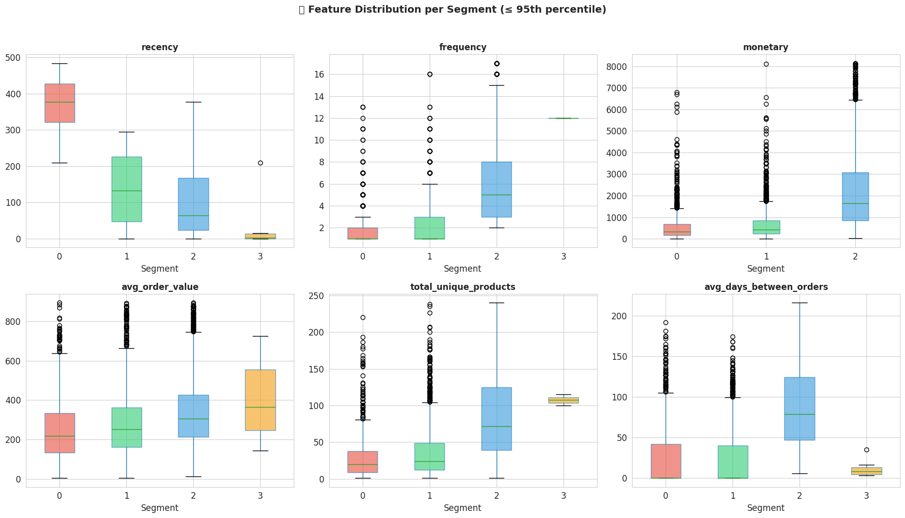

Biểu đồ boxplot hiển thị **phân bố giá trị thực tế** (chưa chuẩn hóa) của 6 đặc trưng chính theo từng phân khúc. Dữ liệu đã được **clip tại phân vị 95** (95th percentile) để loại bỏ các giá trị ngoại lai cực đoan, giúp biểu đồ dễ đọc hơn mà không bị "kéo dãn" bởi một vài khách hàng có giá trị bất thường.

Giải thích từng đặc trưng:

| Đặc trưng                   | Quan sát từ Boxplot                                                                                                                                                                                                                                                                                 |
| --------------------------- | --------------------------------------------------------------------------------------------------------------------------------------------------------------------------------------------------------------------------------------------------------------------------------------------------- |
| **recency**                 | Cluster 0 (Ngủ đông) có median ~370 ngày và hộp rộng (300–430), hoàn toàn tách biệt khỏi các cụm khác. Cluster 1 & 2 ở mức 50–160 ngày. Cluster 3 (VIP) rất thấp (~10 ngày) — xác nhận VIP mua gần đây nhất.                                                                                        |
| **frequency**               | Cluster 0 & 1 đều tập trung ở 1–2 lần (median ≈ 2). Cluster 2 nổi bật với median ~5 và hộp rộng (3–8 lần). Cluster 3 (VIP) có frequency cực cao (~12–16), vượt xa mọi nhóm. Các chấm tròn phía trên là outliers (khách mua nhiều hơn bình thường trong nhóm).                                       |
| **monetary**                | Cluster 0 & 1 có doanh thu thấp (median ~£500–700). Cluster 2 có phạm vi rộng hơn (£1,000–£5,000). Cluster 3 có doanh thu cực cao (£3,000–£8,000+), xác nhận giá trị kinh doanh vượt trội của nhóm VIP.                                                                                             |
| **avg_order_value**         | Tương đối đồng đều giữa Cluster 0, 1, 2 (median ~£200–300). Cluster 3 (VIP) có sự phân tán lớn hơn (£100–£500), cho thấy VIP mua nhiều loại đơn hàng khác nhau, từ nhỏ đến lớn.                                                                                                                     |
| **total_unique_products**   | Cluster 0 & 1 ở mức thấp (10–40 sản phẩm). Cluster 2 trung bình (30–120). Cluster 3 (VIP) tập trung ở ~100 sản phẩm với hộp rất hẹp — VIP có danh mục mua sắm đa dạng và ổn định.                                                                                                                   |
| **avg_days_between_orders** | Cluster 0 có giá trị thấp (~20–30 ngày) vì khách Ngủ đông thường chỉ mua 1–2 lần nên khoảng cách tính được nhỏ. Cluster 2 (Tiềm năng) có phạm vi rộng nhất (30–130 ngày), phản ánh sự đa dạng trong hành vi mua lặp lại. Cluster 3 (VIP) rất thấp (~10 ngày) vì VIP mua liên tục, khoảng cách ngắn. |

> **Nhận xét tổng hợp từ Radar Chart & Feature Distribution:**
>
> - Nhóm **VIP** (0.3%) có "hồ sơ" áp đảo trên mọi chỉ số: tần suất mua cực cao (129 lần), doanh thu khổng lồ (£144,842), mua gần đây nhất — đây là nhóm cần ưu tiên chăm sóc đặc biệt với các chương trình loyalty riêng.
> - Nhóm **Tiềm năng** (44.5%) chiếm đa số, có recency tốt, frequency ổn định và monetary trung bình khá — đây là **mục tiêu lý tưởng** cho Dynamic Voucher nhằm thúc đẩy tăng tần suất mua.
> - Nhóm **Vãng lai** (33.9%) có hoạt động thấp đều, cần chiến dịch **welcome-back** hoặc ưu đãi lần mua đầu để kích thích.
> - Nhóm **Ngủ đông** (21.3%) có recency rất cao (410 ngày), cần chiến dịch **re-engagement** mạnh (email nhắc nhở, giảm giá đặc biệt) hoặc đánh giá lại chi phí duy trì.

### 5.3. Mô hình Gợi ý sản phẩm (TF-IDF + KNN)

Hệ thống gợi ý sử dụng **Content-based Filtering**, kết hợp đặc trưng ngữ nghĩa (text) từ mô tả sản phẩm và thuộc tính số học (giá, tần suất mua) để tìm sản phẩm tương đồng. Pipeline gồm 4 bước chính: Xây dựng Product Features → TF-IDF Vectorization → Kết hợp Feature Matrix → KNN Fitting.

**a) Chuẩn bị dữ liệu sản phẩm (Product Features Table)**

Từ bảng `transactions_clean.csv`, mỗi sản phẩm (StockCode) được tổng hợp thành 1 hàng với các đặc trưng thống kê:

| Đặc trưng           | Cách tính                           | Ý nghĩa                           |
| ------------------- | ----------------------------------- | --------------------------------- |
| `description`       | Mode (giá trị xuất hiện nhiều nhất) | Tên mô tả sản phẩm                |
| `avg_price`         | Trung bình `Price`                  | Giá trung bình (£)                |
| `purchase_count`    | Số lượng `Invoice` duy nhất         | Số đơn hàng chứa sản phẩm này     |
| `total_qty_sold`    | Tổng `Quantity`                     | Tổng số lượng đã bán              |
| `avg_qty_per_order` | Trung bình `Quantity`               | Số lượng trung bình mỗi đơn hàng  |
| `num_customers`     | Số `Customer ID` duy nhất           | Số khách hàng đã mua sản phẩm này |

Sau khi loại bỏ sản phẩm không có mô tả và sản phẩm chỉ xuất hiện 1 lần (noise), tập dữ liệu còn lại **4,499 sản phẩm**.

**Bảng 6: Thống kê tổng quan Product Features**

| Thống kê | avg_price (£) | purchase_count | total_qty_sold | num_customers |
| -------- | ------------- | -------------- | -------------- | ------------- |
| Mean     | 3.76          | 170            | 2,357          | 107           |
| Std      | 8.83          | 281            | 5,736          | 136           |
| Min      | 0.05          | 2              | 2              | 1             |
| 25%      | 1.19          | 20             | 139            | 18            |
| 50%      | 2.06          | 69             | 679            | 56            |
| 75%      | 3.92          | 194            | 2,154          | 141           |
| Max      | 243.68        | 4,895          | 109,169        | 1,490         |

> Dữ liệu có phân bố **lệch phải** rất mạnh (std >> mean), cho thấy một số ít sản phẩm bán chạy áp đảo (top sellers), trong khi phần lớn sản phẩm có lượt mua thấp.

**b) TF-IDF Vectorization (Chuyển text → vector)**

Mô tả sản phẩm (`description`) được chuyển thành vector số bằng **TF-IDF** (Term Frequency – Inverse Document Frequency):

| Tham số      | Giá trị                       |
| ------------ | ----------------------------- |
| max_features | 500 terms                     |
| stop_words   | english (loại bỏ từ phổ biến) |
| Kết quả      | Ma trận (4,499 × 500)         |

**Top 10 TF-IDF Terms (tổng trọng số cao nhất):**

| #   | Term    | Tổng TF-IDF |
| --- | ------- | ----------- |
| 1   | set     | 155.83      |
| 2   | pink    | 139.10      |
| 3   | blue    | 118.25      |
| 4   | heart   | 95.71       |
| 5   | glass   | 90.62       |
| 6   | red     | 87.93       |
| 7   | vintage | 86.18       |
| 8   | white   | 83.78       |
| 9   | candle  | 79.78       |
| 10  | flower  | 71.99       |

> Các từ có trọng số cao nhất phản ánh đặc thù của cửa hàng: sản phẩm quà tặng, trang trí (set, heart, candle, flower, vintage). Màu sắc (pink, blue, red, white) cũng là yếu tố phân biệt quan trọng.

**c) Kết hợp Feature Matrix**

TF-IDF features (500 chiều) được kết hợp với 5 numeric features đã chuẩn hóa, với **trọng số ×0.3** cho numeric features để tránh lấn át đặc trưng text:

| Thành phần           | Số chiều | Chi tiết                                                                                     |
| -------------------- | -------- | -------------------------------------------------------------------------------------------- |
| TF-IDF Features      | 500      | Vector từ mô tả sản phẩm                                                                     |
| Numeric Features     | 5        | `avg_price`, `purchase_count`, `total_qty_sold`, `num_customers`, `avg_qty_per_order` (×0.3) |
| **Ma trận tổng hợp** | **505**  | **(4,499 sản phẩm × 505 features)**                                                          |

> Trọng số 0.3 cho numeric features đảm bảo hệ thống ưu tiên **ngữ nghĩa mô tả** (ví dụ: "HEART T-LIGHT HOLDER" tương đồng với "HANGING HEART T-LIGHT HOLDER") hơn là chỉ dựa trên giá cả hay số lượng bán.

**d) Cấu hình KNN (K-Nearest Neighbors)**

| Tham số           | Giá trị                |
| ----------------- | ---------------------- |
| N neighbors       | 10 (loại trừ chính nó) |
| Metric            | Cosine Similarity      |
| Products in index | 4,499                  |

Cosine Similarity đo **góc** giữa hai vector feature — hai sản phẩm có mô tả tương tự và thuộc tính gần nhau sẽ có similarity gần 1.0.

**e) Demo kết quả gợi ý (Top-5 sản phẩm bán chạy nhất)**

Thử nghiệm với 5 sản phẩm có lượt mua cao nhất:

**Sản phẩm 1: WHITE HANGING HEART T-LIGHT HOLDER** (StockCode: 85123A | £2.87 | 4,895 lượt mua)

| #   | Sản phẩm gợi ý                     | Giá (£) | Similarity |
| --- | ---------------------------------- | ------- | ---------- |
| 1   | RED HANGING HEART T-LIGHT HOLDER   | 2.92    | 0.869      |
| 2   | HANGING HEART ZINC T-LIGHT HOLDER  | 0.85    | 0.833      |
| 3   | HANGING HEART JAR T-LIGHT HOLDER   | 1.23    | 0.818      |
| 4   | HEART T-LIGHT HOLDER WILLIE WINKIE | 1.68    | 0.641      |
| 5   | HEART T-LIGHT HOLDER               | 0.91    | 0.639      |

**Sản phẩm 2: REGENCY CAKESTAND 3 TIER** (StockCode: 22423 | £12.46 | 3,317 lượt mua)

| #   | Sản phẩm gợi ý              | Giá (£) | Similarity |
| --- | --------------------------- | ------- | ---------- |
| 1   | SWEETHEART CAKESTAND 3 TIER | 9.84    | 0.543      |
| 2   | REGENCY CAKE SLICE          | 4.92    | 0.533      |
| 3   | REGENCY CAKE FORK           | 1.23    | 0.532      |
| 4   | REGENCY TEA STRAINER        | 3.75    | 0.517      |
| 5   | REGENCY TEA SPOON           | 1.23    | 0.514      |

**Sản phẩm 3: JUMBO BAG RED RETROSPOT** (StockCode: 85099B | £1.96 | 3,260 lượt mua)

| #   | Sản phẩm gợi ý            | Giá (£) | Similarity |
| --- | ------------------------- | ------- | ---------- |
| 1   | JUMBO BAG OWLS            | 1.97    | 0.736      |
| 2   | JUMBO BAG TOYS            | 1.95    | 0.728      |
| 3   | JUMBO BAG PEARS           | 2.07    | 0.721      |
| 4   | RED RETROSPOT SHOPPER BAG | 1.25    | 0.717      |
| 5   | RED RETROSPOT PEG BAG     | 2.28    | 0.710      |

**Sản phẩm 4: ASSORTED COLOUR BIRD ORNAMENT** (StockCode: 84879 | £1.68 | 2,652 lượt mua)

| #   | Sản phẩm gợi ý                      | Giá (£) | Similarity |
| --- | ----------------------------------- | ------- | ---------- |
| 1   | ASSORTED COLOUR SILK GLASSES CASE   | 1.38    | 0.839      |
| 2   | BOX OF 6 ASSORTED COLOUR TEASPOONS  | 4.31    | 0.776      |
| 3   | ASSORTED COLOUR LIZARD SUCTION HOOK | 0.42    | 0.737      |
| 4   | ASSORTED COLOUR SILK COIN PURSE     | 0.89    | 0.727      |
| 5   | ASSORTED COLOUR SILK COSMETIC PURSE | 1.90    | 0.725      |

**Sản phẩm 5: LUNCH BAG RED RETROSPOT** (StockCode: 20725 | £1.65 | 2,579 lượt mua)

| #   | Sản phẩm gợi ý            | Giá (£) | Similarity |
| --- | ------------------------- | ------- | ---------- |
| 1   | LUNCH BAG CARS BLUE       | 1.65    | 0.728      |
| 2   | RED RETROSPOT SHOPPER BAG | 1.25    | 0.722      |
| 3   | RED RETROSPOT PEG BAG     | 2.28    | 0.718      |
| 4   | LUNCH BAG SUKI DESIGN     | 1.65    | 0.710      |
| 5   | LUNCH BAG APPLE DESIGN    | 1.64    | 0.697      |

> **Nhận xét:** Thuật toán cho thấy khả năng nhận diện ngữ nghĩa rất tốt — các sản phẩm được gợi ý luôn cùng dòng sản phẩm (ví dụ: T-Light Holder → T-Light Holder, Jumbo Bag → Jumbo Bag, Lunch Bag → Lunch Bag). Đặc biệt, sản phẩm "ASSORTED COLOUR BIRD ORNAMENT" gợi ý các sản phẩm "ASSORTED COLOUR" khác, cho thấy TF-IDF nắm bắt được cụm từ chung (shared term pattern). Điểm Cosine Similarity trung bình > 0.7 ở đa số trường hợp.

**f) Heatmap độ tương đồng (Top 20 sản phẩm)**

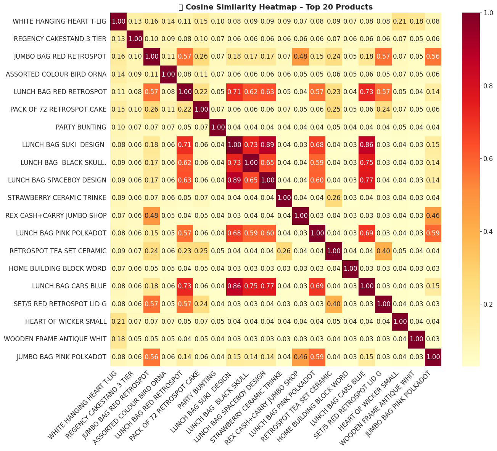

Heatmap thể hiện ma trận Cosine Similarity giữa 20 sản phẩm bán chạy nhất. Mỗi ô (i, j) hiển thị mức độ tương đồng giữa sản phẩm i và sản phẩm j:

- **Đường chéo chính** luôn có giá trị = 1.0 (sản phẩm giống chính nó 100%)
- **Vùng màu sáng (vàng/cam)** = similarity cao → các sản phẩm rất giống nhau
- **Vùng màu tối (xanh đậm)** = similarity thấp → sản phẩm khác biệt

> Từ heatmap, có thể thấy các "cụm sản phẩm tương đồng" tự nhiên — ví dụ nhóm Bag (Jumbo Bag, Lunch Bag, Shopper Bag) có similarity cao lẫn nhau, tạo thành vùng sáng. Điều này xác nhận mô hình đang hoạt động đúng logic.

**g) Đánh giá Hit Rate**

Để đánh giá chất lượng gợi ý trên **dữ liệu hành vi thực tế**, hệ thống sử dụng phương pháp **Hit Rate**:

**Phương pháp:** Với mỗi khách hàng đã mua ≥ 5 sản phẩm (5,538 khách), lấy từng sản phẩm mà khách đó đã mua → gọi Top-10 gợi ý → kiểm tra xem có bao nhiêu sản phẩm trong Top-10 trùng với sản phẩm khác mà khách đó cũng đã mua. Nếu có ≥ 1 trùng → tính là "Hit".

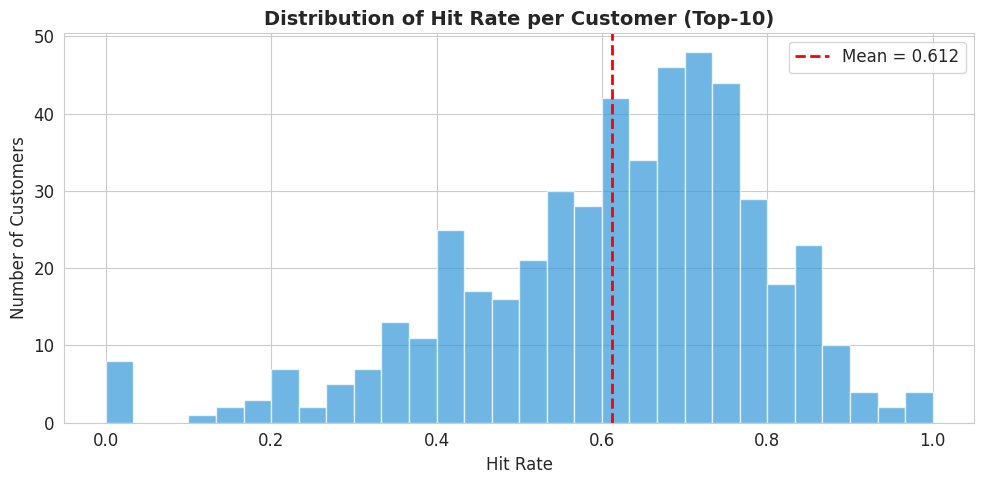

| Chỉ số                | Giá trị   | Ý nghĩa                                                                   |
| --------------------- | --------- | ------------------------------------------------------------------------- |
| Overall Hit Rate      | **72.2%** | Cứ 10 lần gợi ý thì ~7.2 lần có ít nhất 1 sản phẩm trùng hành vi mua thực |
| Avg Customer Hit Rate | **61.2%** | Trung bình mỗi khách hàng có 61.2% lượt gợi ý trúng                       |
| Total Queries         | 42,211    | Tổng số lần gọi hệ thống gợi ý                                            |
| Total Hits            | 30,457    | Số lần gợi ý trúng hành vi mua thực tế                                    |

> **Nhận xét:** Hit Rate đạt 72.2% là kết quả rất ấn tượng cho mô hình **Content-based thuần túy** (không sử dụng Collaborative Filtering). Con số này cho thấy việc kết hợp TF-IDF (ngữ nghĩa) + Numeric Features (giá/lượt mua) là chiến lược hiệu quả, đặc biệt khi hệ thống chỉ cần tên mô tả sản phẩm mà không cần ảnh hay metadata phức tạp.

**h) Artifacts đã xuất**

| File                             | Mô tả                                  |
| -------------------------------- | -------------------------------------- |
| `knn_model.joblib`               | Mô hình KNN đã fit                     |
| `tfidf_vectorizer.joblib`        | TF-IDF vectorizer đã train             |
| `scaler_product.joblib`          | StandardScaler cho numeric features    |
| `product_features_matrix.joblib` | Ma trận feature tổng hợp (4,499 × 505) |
| `product_lookup.csv`             | Bảng tra cứu StockCode ↔ Description   |
| `product_mappings.json`          | Mapping index ↔ StockCode              |
| `knn_config.json`                | Cấu hình KNN (K, metric, weights)      |

### 5.4. Retrain Random Forest với Segment ID

Ý tưởng cốt lõi của notebook này là tận dụng kết quả phân cụm (K-Means từ Notebook 03) để **bổ sung thêm đặc trưng `segment_id`** vào mô hình Random Forest, tạo sự liên kết giữa các mô hình ML trong hệ thống. Đây là bước "khép kín" pipeline: kết quả của mô hình unsupervised (K-Means) trở thành input cho mô hình supervised (Random Forest).

**a) Chuẩn bị dữ liệu**

Dữ liệu đầu vào là file `customer_features_with_segments.csv` (5,023 khách hàng) — kết hợp giữa customer features từ Notebook 01 và `segment_id` từ Notebook 03.

| Thông số           | Giá trị                                |
| ------------------ | -------------------------------------- |
| Tổng mẫu           | 5,023 khách hàng                       |
| Train / Test       | 4,018 / 1,005 (80/20)                  |
| Features cũ (NB02) | 13 features (RFM + Behavioral)         |
| Features mới       | **14 features** (13 cũ + `segment_id`) |

**Phân bố segment_id trong tập dữ liệu:**

| segment_id | Tên gọi      | Số lượng |
| ---------- | ------------ | -------- |
| 0          | 💤 Ngủ đông  | 1,069    |
| 1          | 👋 Vãng lai  | 1,702    |
| 2          | 🌟 Tiềm năng | 2,237    |
| 3          | 🏆 VIP       | 15       |

**b) GridSearchCV — Tìm siêu tham số tối ưu**

Mô hình RF mới được tuning lại từ đầu với GridSearchCV:

| Tham số GridSearch | Giá trị           |
| ------------------ | ----------------- |
| Tổng candidates    | 108 tổ hợp        |
| CV Folds           | 5-Fold Stratified |
| Tổng fits          | 540               |
| Scoring            | F1-Score          |

**Siêu tham số tối ưu tìm được:**

| Tham số           | Giá trị               |
| ----------------- | --------------------- |
| class_weight      | balanced              |
| max_depth         | None (không giới hạn) |
| min_samples_leaf  | 4                     |
| min_samples_split | 10                    |
| n_estimators      | 100                   |
| **Best CV F1**    | **0.7408**            |

> **So sánh:** Mô hình NB02 có `max_depth=10`, mô hình mới có `max_depth=None`. Điều này cho thấy khi thêm `segment_id`, cây quyết định cần "sâu hơn" để tận dụng thông tin phân khúc — `segment_id` giúp mô hình phân tách chi tiết hơn trong các nhánh con.

**c) So sánh RF không segment vs có segment**

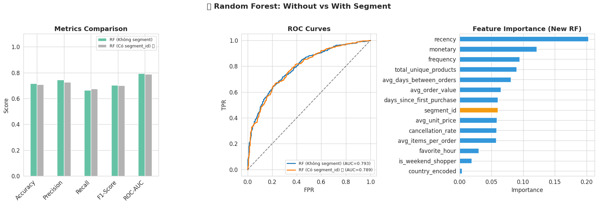

Biểu đồ gồm 3 phần: (1) So sánh metrics bar chart, (2) Feature Importance mới với `segment_id`, (3) Confusion Matrix so sánh.

**Bảng 7: So sánh hiệu suất trên tập Test (1,005 mẫu)**

| Chỉ số    | RF (Không segment) | RF (Có segment_id) | Thay đổi   | Đánh giá           |
| --------- | ------------------ | ------------------ | ---------- | ------------------ |
| Accuracy  | 0.7164             | 0.7085             | -0.008     | Giảm nhẹ           |
| Precision | 0.7450             | 0.7271             | -0.018     | Giảm nhẹ           |
| Recall    | 0.6640             | **0.6739**         | **+0.010** | ⬆️ **Cải thiện**   |
| F1-Score  | 0.7022             | 0.6995             | -0.003     | Gần như giữ nguyên |
| ROC-AUC   | 0.7931             | 0.7891             | -0.004     | Gần như giữ nguyên |

> **Phân tích:**
>
> - **Recall tăng (+1.0%):** Mô hình mới phát hiện được nhiều khách hàng tiềm năng hơn. Trong bài toán E-commerce, Recall quan trọng hơn Precision vì chi phí "bỏ sót" khách hàng (mất doanh thu) thường lớn hơn chi phí "gửi nhầm" voucher.
> - **Precision giảm nhẹ (-1.8%):** Đổi lại, mô hình dự đoán "rộng" hơn nên có thêm một số false positive. Tuy nhiên, mức giảm này chấp nhận được.
> - **Feature `segment_id` đóng góp ở vị trí #8** (importance = 0.0600), cho thấy nó bổ sung thông tin có ý nghĩa nhưng không gây nhiễu hay lấn át các features chính (recency, monetary, frequency vẫn dẫn đầu).

**d) Cross-Validation mô hình cuối cùng**

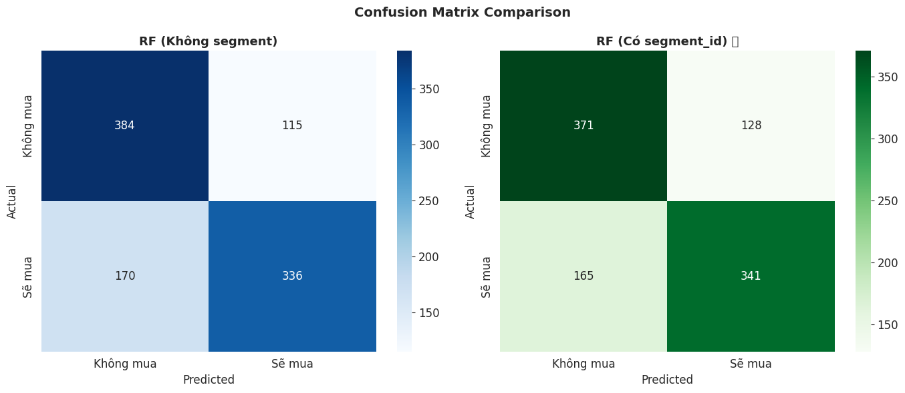

Biểu đồ gồm: (1) Boxplot phân bố các metrics qua 5 folds, (2) ROC Curve trung bình với 95% confidence interval.

**Bảng 8: 5-Fold Stratified Cross-Validation (RF + segment_id)**

| Metric       | Mean ± Std      | Min    | Max    |
| ------------ | --------------- | ------ | ------ |
| CV Accuracy  | 0.7386 ± 0.0082 | ~0.727 | ~0.750 |
| CV F1-Score  | 0.7306 ± 0.0118 | ~0.715 | ~0.745 |
| CV ROC-AUC   | 0.8127 ± 0.0140 | ~0.795 | ~0.830 |
| CV Precision | 0.7590 ± 0.0124 | ~0.742 | ~0.775 |
| CV Recall    | 0.7049 ± 0.0252 | ~0.675 | ~0.740 |

> **Nhận xét:** Std (độ lệch chuẩn) thấp ở tất cả metrics (< 0.03), xác nhận mô hình **ổn định** và không bị overfitting. ROC-AUC trung bình đạt **0.8127** (> 0.8), cho thấy khả năng phân tách tốt giữa hai lớp.

**e) Tổng kết Pipeline — 3 mô hình đã hoàn thành**

| Model             | Vai trò             | Chỉ số chính                   | Files xuất                                        | Kích thước |
| ----------------- | ------------------- | ------------------------------ | ------------------------------------------------- | ---------- |
| **Random Forest** | Dự đoán mua hàng    | CV F1: 0.7306, ROC-AUC: 0.8127 | `random_forest_model.joblib`, `scaler_rfm.joblib` | 4.9 MB     |
| **PCA + K-Means** | Phân cụm khách hàng | Silhouette: 0.3740, K=4        | `kmeans_model.joblib`, `pca_transformer.joblib`   | 21.6 KB    |
| **TF-IDF + KNN**  | Gợi ý sản phẩm      | Hit Rate: 72.2%                | `knn_model.joblib`, `tfidf_vectorizer.joblib`     | 483.4 KB   |

**Tổng cộng artifacts đã xuất cho Backend:**

| Thư mục   | Files                         | Tổng dung lượng |
| --------- | ----------------------------- | --------------- |
| `models/` | 14 files (`.joblib`, `.json`) | ~5.1 MB         |
| `data/`   | 5 files (`.csv`, `.json`)     | ~82.6 MB        |
| **Tổng**  | **19 files**                  | **~88.6 MB**    |

> **Liên kết giữa các mô hình (Model Pipeline):**
>
> - **K-Means** → `segment_id` → đầu vào cho **Random Forest** (feature #14)
> - **Random Forest** → `purchase_probability` → Ngưỡng 0.30 kích hoạt **Dynamic Voucher**
> - **Random Forest** → threshold → **Smart Promotion Popup** trên giao diện
> - **KNN** → Danh sách Top-10 sản phẩm gợi ý → Hiển thị trên trang sản phẩm

---

## 6. Kết luận

**Đã làm được gì:**

- Xây dựng thành công hệ thống từ con số không (Raw Data), hoàn thiện 5 Notebooks ML bao gồm cả việc tái huấn luyện (Retrain) thông minh.
- Triển khai toàn bộ Model lên một server Backend (FastAPI) đáp ứng khả năng tính toán thời gian thực.
- Thiết kế hệ thống Backend Clean Code với Dependency Injection, và một hệ thống tính năng Dynamic Voucher hoàn toàn tự động, độc đáo dựa trên xác suất mua hàng.

**Ưu điểm:**

- Hệ thống giải quyết trọn vẹn cả 3 bài toán lớn nhất của E-commerce (Dự đoán, Phân cụm, Gợi ý).
- Có sự giao tiếp giữa các mô hình (Lấy nhãn từ mô hình Phân cụm để cải thiện mô hình Dự đoán).
- Mã nguồn tổ chức logic, có đầy đủ script tự động chạy, làm sạch DB và khởi tạo.

**Nhược điểm & Hướng phát triển:**

- Hiện tại mô hình Gợi ý chỉ dùng Content-based, chưa tận dụng Collaborative Filtering (để gợi ý chéo đa dạng hơn).
- Ở mức độ sản xuất lớn (Production), việc tính toán RFM trực tiếp từ database sẽ gây tải nặng, cần sử dụng Redis để Caching hoặc chạy tác vụ định kỳ qua Apache Airflow hoặc Message Queue (RabbitMQ).

Hệ thống cung cấp một minh chứng rõ nét về tiềm năng ứng dụng Trí tuệ nhân tạo vào quy trình kinh doanh, góp phần tối ưu hóa cả trải nghiệm người dùng lẫn lợi nhuận của doanh nghiệp.
